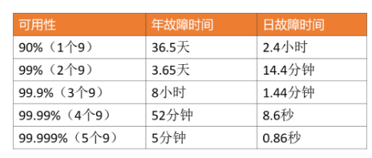

# 什么是高并发？

## 1. 高并发系统设计的宏观目标

### 1.1 高性能

性能体现了系统的并行处理能力，在有限的硬件投入下，提高性能意味着节省成本。同时，性能也反映了用户体验，响应时间分别是100毫秒和1秒，给用户的感受是完全不同的。

### 1.2 高可用

表示系统可以正常服务的时间。一个全年不停机、无故障；另一个隔三差五出线上事故、宕机，用户肯定选择前者。另外，如果系统只能做到90%可用，也会大大拖累业务。

为了保证可用性，通常会对服务接口进行超时设置，以防大量线程阻塞在慢请求上造成系统雪崩，那超时时间设置成多少合理呢？一般，我们会参考依赖服务的性能表现进行设置。

### 1.3 高扩展

表示系统的扩展能力，流量高峰时能否在短时间内完成扩容，更平稳地承接峰值流量，比如双11活动、明星离婚等热点事件。考虑系统的扩展能力，一般将服务设计成无状态的。

## 2. 微观目标

### 2.1 性能指标

+ 平均响应时间：但对慢请求不敏感。
+ TP90、TP99等分位值：将响应时间按照从小到大排序。
+ 吞吐量：跟响应时间成反比。

### 2.2 可用性指标

可用性 = 平均故障时间 / 系统总运行时间

### 2.3 可扩展性指标

扩展性 = 性能提升比例 / 机器增加比例

## 3. 设计方法

### 3.1 纵向扩展

目标是提升单机的处理能力

+ 提升单机的硬件性能：通过增加内存、CPU核数、存储容量、或者将磁盘升级成SSD等堆硬件的方式来提升。
+ 提升单机的软件性能：使用缓存减少IO次数，使用并发或者异步的方式增加吞吐量。

### 3.2 横向扩展

+ 做好分层架构。
+ 各层进行水平扩展：无状态水平扩容，有状态做分片路由。

## 4. 实践方案

### 4.1 高性能

+ （1）集群部署，通过负载均衡减轻单机压力。
+ （2）多级缓存，包括静态数据使用CDN、本地缓存、分布式缓存等，以及对缓存场景中的热点key、缓存穿透、缓存并发、数据一致性等问题的处理。
+ （3）分库分表和索引优化，以及借助搜索引擎解决复杂查询问题。
+ （4）考虑NoSQL数据库的使用，比如HBase、TiDB等，但是团队必须熟悉这些组件，且有较强的运维能力。
+ （5）异步化，将次要流程通过多线程、MQ、甚至延时任务进行异步处理。
+ （6）限流，需要先考虑业务是否允许限流（比如秒杀场景是允许的），包括前端限流、Nginx接入层的限流、服务端的限流。
+ （7）对流量进行削峰填谷，通过MQ承接流量。
+ （8）并发处理，通过多线程将串行逻辑并行化。
+ （9）预计算，比如抢红包场景，可以提前计算好红包金额缓存起来，发红包时直接使用即可。
+ （10）缓存预热，通过异步任务提前预热数据到本地缓存或者分布式缓存中。
+ （11）减少IO次数，比如数据库和缓存的批量读写、RPC的批量接口支持、或者通过冗余数据的方式干掉RPC调用。
+ （12）减少IO时的数据包大小，包括采用轻量级的通信协议、合适的数据结构、去掉接口中的多余字段、减少缓存key的大小、压缩缓存value等。
+ （13）程序逻辑优化，比如将大概率阻断执行流程的判断逻辑前置、For循环的计算逻辑优化，或者采用更高效的算法。
+ （14）各种池化技术的使用和池大小的设置，包括HTTP请求池、线程池（考虑CPU密集型还是IO密集型设置核心参数）、数据库和Redis连接池等。
+ （15）JVM优化，包括新生代和老年代的大小、GC算法的选择等，尽可能减少GC频率和耗时。
+ （16）锁选择，读多写少的场景用乐观锁，或者考虑通过分段锁的方式减少锁冲突。

### 4.2 高可用

+ （1）对等节点的故障转移，Nginx和服务治理框架均支持一个节点失败后访问另一个节点。
+ （2）非对等节点的故障转移，通过心跳检测并实施主备切换（比如redis的哨兵模式或者集群模式、MySQL的主从切换等）。
+ （3）接口层面的超时设置、重试策略和幂等设计。可以通过收集系统之间的调用日志，统计比如说99%的响应时间是怎样的，然后依据这个时间来指定超时时间。
+ （4）降级处理：保证核心服务，牺牲非核心服务，必要时进行熔断；或者核心链路出问题时，有备选链路。
+ （5）限流处理：对超过系统处理能力的请求直接拒绝或者返回错误码。
+ （6）Q场景的消息可靠性保证，包括producer端的重试机制、broker侧的持久化、consumer端的ack机制等。
+ （7）灰度发布，能支持按机器维度进行小流量部署，观察系统日志和业务指标，等运行平稳后再推全量。
+ （8）监控报警：全方位的监控体系，包括最基础的CPU、内存、磁盘、网络的监控，以及Web服务器、JVM、数据库、各类中间件的监控和业务指标的监控。
+ （9）灾备演练：类似当前的“混沌工程”，对系统进行一些破坏性手段，观察局部故障是否会引起可用性问题。

### 4.3 高扩展

+ （1）合理的分层架构：比如上面谈到的互联网最常见的分层架构，另外还能进一步按照数据访问层、业务逻辑层对微服务做更细粒度的分层（但是需要评估性能，会存在网络多一跳的情况）。
+ （2）存储层的拆分：按照业务维度做垂直拆分、按照数据特征维度进一步做水平拆分（分库分表）。
+ （3）业务层的拆分：最常见的是按照业务维度拆（比如电商场景的商品服务、订单服务等），也可以按照核心接口和非核心接口拆，还可以按照请求源拆（比如To C和To B，APP和H5）。
