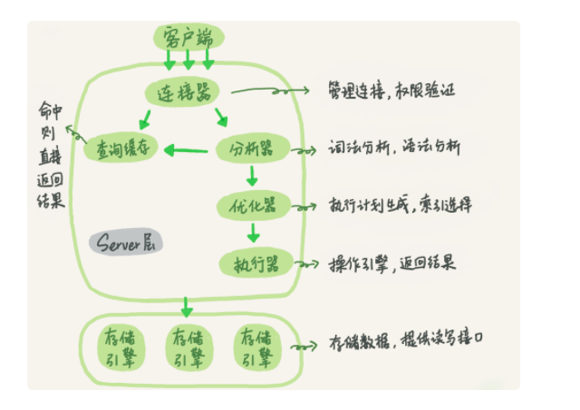
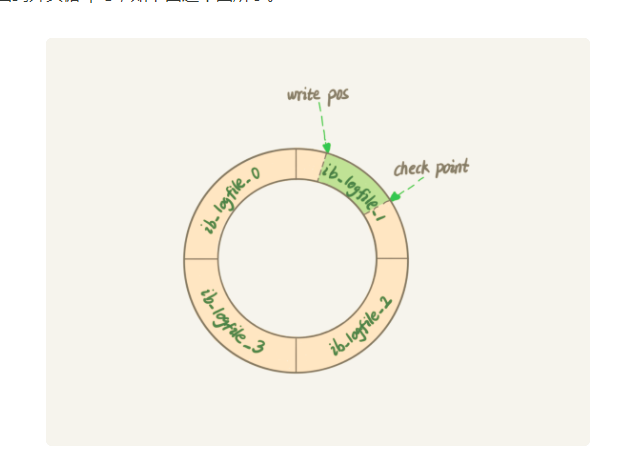
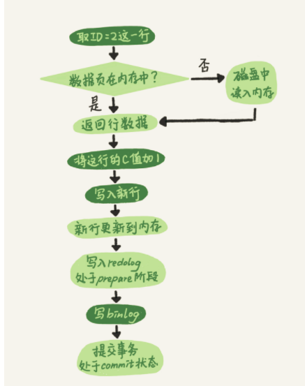
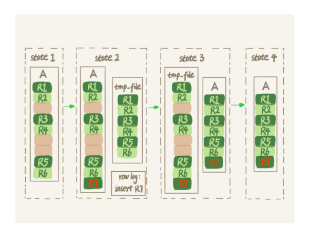

# mysql原理篇

## 通讯

+ 客户端与服务端是半双工的通信方式，即同一时刻只能由客户端发送消息给服务端，或者服务端发送消息给客户端。
+ 客户端的消息传送有大小限制，参数max_allowed_packet
+ 一旦服务端向客户端返回消息，可能会拆分成多个数据包，客户端就必须要等待完整接收完毕。因此有时加上limit限时提取的数据是有必要的。

## 查询语句的执行



## 查询缓存

不建议开启。可通过下面命令查询是否开启

```
show global VARIABLES like 'query_cache_type';
```

## 日志模块

### redo log（InnoDB引擎特有的日志）



循环写，空间固定会用完。

+ write pos：记录当前写的位置
+ check point：记录当前擦除的位置

> `write pos`和`checkpoint`之间可以用来记录新的操作。如果`write pos`追上`checkpoint`，这时候不能再执行新的更新，得停下来先擦掉一些记录，把`checkpoint`推进一下。

#### 参数

```
show global VARIABLES like 'innodb_flush_log_at_trx_commit';
```

`innodb_flush_log_at_trx_commit`设置为1表示每次事务的`redo log`都直接持久化到磁盘。建议设置为1。

### binlog（Server层日志）

追加写，记录的是语句的原始逻辑。通过`事务ID`可以与`redo log`对应。

#### 参数

```
show global VARIABLES like 'sync_binlog';
```

`sync_binlog`设置为1表示每次事务的`binlog`都持久化到磁盘。建议设置为1。

#### MySQL如何判断binlog是完整的

一个事务的 binlog 是有完整格式的：
+ statement格式的binlog：最后会有`COMMIT`；
+ row格式的 binlog：最后会有一个`XID event`。

### redo log和binlog的关联

有一个共同的数据字段，叫`XID`。崩溃恢复的时候，会按顺序扫描`redo log`：

+ 如果碰到既有`prepare`、又有`commit`的`redo log`，就直接提交；
+ 如果碰到只有`prepare`、而没有`commit`的`redo log`，就拿着`XID`去`binlog`找对应的事务。

## 更新语句的执行

两阶段提交，避免任意时刻crash造成的binlog与redo log的数据不一致。



## 事务隔离

+ 读未提交（read uncommitted）：一个事务还没提交时，它做的变更就能被别的事务看到。
+ 读提交（read committed）：一个事务提交之后，它做的变更才会被其他事务看到。
+ 可重复读（repeatable read）：一个事务执行过程中看到的数据，总是跟这个事务在启动时看到的数据是一致的。当然在可重复读隔离级别下，未提交变更对其他事务也是不可见的。
+ 串行化（serializable）：顾名思义是对于同一行记录，“写”会加“写锁”，“读”会加“读锁”。当出现读写锁冲突的时候，后访问的事务必须等前一个事务执行完成，才能继续执行。

查看当前的事务隔离级别：

```
# 5.7.x
show variables like 'transaction_isolation';
# 5.6.x
show variables like 'tx_isolation';
```

查询当前超过60秒的长事务：

```
select * from information_schema.innodb_trx where TIME_TO_SEC(timediff(now(),trx_started))>60
```

## 索引

下面的语句可以重建索引。应用于删除记录不会删除对应的索引。

```
alter table T engine=InnoDB;
```

### 数据结构：B+树

非叶子节点只保存索引，不保存数据，所有数据都保存在叶子节点，所有的叶子结点使用链表相连。

#### 优点

+ 所有的叶子结点使用链表相连，便于区间查找和遍历。B树则需要进行每一层的递归遍历。相邻的元素可能在内存中不相邻，所以缓存命中性没有B+树好。
+ b+树的中间节点不保存数据，能容纳更多节点元素。

### 主键索引（聚簇索引）

叶子节点存的是整行数据。

### 非主键索引（二级索引）

叶子节点内容是主键的值。基于非主键索引的查询需要多扫描一棵索引树。

主键长度越小，普通索引的叶子节点就越小，普通索引占用的空间也就越小。

### 唯一索引与普通索引的选择

`唯一索引`用不上`change buffer`的优化机制，因此从性能角度建议优先考虑`非唯一索引`。

若写入的数据不在内存，对于唯一索引需要把数据页从磁盘读入内存；对于普通索引只需要将数据写入`change buffer`，减少了随机磁盘访问。

如果所有的更新后面，都马上伴随着对这个记录的查询，那么应该关闭`change buffer`。

### 如何给字符串建立索引

使用前缀索引，定义好长度，就可以做到既节省空间，又不用额外增加太多的查询成本。

```
select 
  count(distinct email) as L, 
  count(distinct left(email,4)）as L4,
  count(distinct left(email,5)）as L5,
  count(distinct left(email,6)）as L6,
  count(distinct left(email,7)）as L7,
from SUser;
```

预先设定一个可以接受的损失比例，比如5%。然后，在返回的L4~L7中，找出不小于L*95%的值，假设这里L6、L7都满足，你就可以选择前缀长度为6。

#### 考虑前缀容易重复的场景

##### 倒序存储

```
select field_list from t where id_card = reverse('input_id_card_string');
```

##### 额外添加hash字段

```
alter table t add id_card_crc int unsigned, add index(id_card_crc);
```

## 锁

### 全局锁

加全局读锁：

```
Flush tables with read lock;
```

适用于不支持事务的引擎的`做全库逻辑备份`。

对于事务引擎，可使用`mysqldump`带上参数`–single-transaction`。原理是启动时会开启一个事务，类似RR，拿到一个一致性视图。

### 表级锁

#### 表锁

```
lock tables T read/write;
```

#### 元数据锁（MDL）

读写锁之间互斥，写锁之间互斥，由系统默认在增删查改的时候自动加上。

##### 如何安全地给小表加字段？

+ 可以查到当前执行中的事务。如果你要做DDL变更的表刚好有长事务在执行，要考虑先暂停DDL，或者kill掉这个长事务。
+ 若变更的表是一个热点表，请求很频繁，在`alter table`语句里面设定等待时间。若超时再通过重试命令重复这个过程。

MariaDB、AliDB支持下面命令:

```
ALTER TABLE tbl_name NOWAIT add column ...
ALTER TABLE tbl_name WAIT N add column ... 
```

### 行锁

#### 两阶段锁协议

在InnoDB事务中，行锁是在需要的时候才加上的，但并不是不需要了就立刻释放，而是要等到事务结束时才释放。

#### 死锁


+ innodb_lock_wait_timeout：锁定超时时间，默认为50s
+ innodb_deadlock_detect：开启死锁检测，若发现死锁，主动回滚其中一个事务。死锁检测要耗费大量的CPU资源。

### 与事务隔离的结合

一个数据版本，对于一个`事务视图`来说，

+ 自己的更新总是可见；
+ 版本未提交，不可见；
+ 版本已提交，但是是在视图创建后提交的，不可见；
+ 版本已提交，而且是在视图创建前提交的，可见。

> 事务更新数据的时候，只能用当前读。如果当前的记录的行锁被其他事务占用的话，就需要进入锁等待。

## 内存数据页

当内存数据页跟磁盘数据页内容不一致的时候，我们称这个内存页为“脏页”。内存数据写入到磁盘后，内存和磁盘上的数据页的内容就一致了，称为“干净页”。

### 刷脏页场景

+ InnoDB的`redo log`写满了。
+ 系统内存不足。当需要新的内存页，而内存不够用的时候，就要淘汰一些数据页，空出内存给别的数据页使用。如果淘汰的是“脏页”，就要先将脏页写到磁盘。
+ 系统`空闲`的时候。
+ MySQL正常关闭的情况。

### 刷脏页影响性能场景

+ 一个查询要淘汰的脏页个数太多，会导致查询的响应时间明显变长；
+ `redo log`日志写满，更新全部堵住，写性能跌为0，这种情况对敏感业务来说，是不能接受的。

### 调优参数

#### innodb_io_capacity

磁盘能力，建议设置为磁盘的IOPS，可以通过`fio`这个工具来测试：

```
 fio -filename=$filename -direct=1 -iodepth 1 -thread -rw=randrw -ioengine=psync -bs=16k -size=500M -numjobs=10 -runtime=10 -group_reporting -name=mytest 
```

#### innodb_max_dirty_pages_pct

脏页比例上限，默认是75%。

#### 计算脏页比例

```
select VARIABLE_VALUE into @a from performance.global_status where VARIABLE_NAME = 'Innodb_buffer_pool_pages_dirty';
select VARIABLE_VALUE into @b from performance.global_status where VARIABLE_NAME = 'Innodb_buffer_pool_pages_total';
select @a/@b;
``` 

#### innodb_flush_neighbors

值为1的时候会将邻近的数据脏页一起刷盘，“连坐”机制，值为0时表示不找邻居，自己刷自己的。

> SSD这类IOPS比较高的设备建议设置为0。

## 表数据存储

`delete`命令只是把记录的位置，或者数据页标记为了“可复用”，但磁盘文件的大小是不会变的。也就是说，通过`delete`命令是不能回收表空间的。

### innodb_file_per_table

+ 这个参数设置为`OFF`表示的是，表的数据放在系统共享表空间，也就是跟数据字典放在一起；
+ 这个参数设置为`ON`表示的是，每个InnoDB表数据存储在一个以`.ibd`为后缀的文件中。（推荐）

### 重建表

```
alter table A engine=InnoDB;
```

流程如下：

+ 建立一个临时文件，扫描表A主键的所有数据页；
+ 用数据页中表A的记录生成`B+`树，存储到临时文件中；
+ 生成临时文件的过程中，将所有对表A的操作记录在一个日志文件（row log）中，对应的是图中`state2`的状态；
+ 临时文件生成后，将日志文件中的操作应用到临时文件，得到一个逻辑数据上与表A相同的数据文件，对应的就是图中`state3`的状态；
+ 用临时文件替换表A的数据文件。



## 统计行数

count(字段)<count(主键)<count(1)≈count(*)

+ COUNT(主键)：InnoDB引擎会遍历整张表，把每一行的id值都取出来，返回给server层。server层拿到id后，判断是不可能为空的，就按行累加。
+ COUNT(字段)：如果字段是定义`为not null`的话，一行行地从记录里面读出这个字段，判断不能为null，按行累加；如果字段定义允许为null，那么执行的时候，判断到有可能是null，还要把值取出来再判断一下，不是null才累加。
+ COUNT(1)：InnoDB引擎遍历整张表，但不取值。server层对于返回的每一行，放一个数字1进去，判断是不可能为空的，按行累加。
+ COUNT(*)：MYSQL专门做了优化，按行累加。

## 排序`order by`

MySQL会给每个线程分配一块内存用于排序，称为`sort_buffer`。

参数`sort_buffer_size`定义了为排序开辟的内存大小。如果要排序的数据量小于`sort_buffer_size`，排序就在内存中完成。但如果排序数据量太大，内存放不下，则不得不利用磁盘临时文件辅助排序。外部排序一般使用归并排序算法。将多个小文件合并成一个有序的大文件。

参数`max_length_for_sort_data`定义了排序的单行最大长度。

### 全字段排序


### rowid排序

应用于`排序的单行长度太大`的场景。


# mysql开发篇

## 数据类型

+ 更小的通常更好。占用更小的磁盘空间。
+ 避免NULL。尽量设计为NOT NULL。

> 注：对于日期，可允许NULL，避免"0000-00-00 00:00:00"

## 索引

### 底层

`B+树`实现，最左前缀匹配（索引多个列）

### 哈希索引

应用：比如url一列一般比较长，那么可以增加一列，对url做CRC编码，索引使用CRC编码后的数据列。只适用于等值索引，不适合范围索引。

### 选择性计算公式

```
SELECT COUNT(DISTINCT your_column)/COUNT(*) FROM your_table;
```

## 主键

最好选择顺序的主键策略，尽量避免采用像UUID这种随机的字符串作为主键，影响性能！

## 创建数据库指定编码和排序规则

```
CREATE DATABASE `test2` DEFAULT CHARACTER SET utf8mb4 COLLATE utf8mb4_general_ci;
```

## 分页的优化

### 延迟关联

```
SELECT film.id, film.description FROM film INNER JOIN (SELECT id FROM film ORDER BY title LIMIT 10000, 10) AS f USING(id);
```

### 范围查询

```
SELECT * FROM film WHERE id < 10000 ORDER BY title DESC LIMIT 50;
```

# 面试题

## 如何从一个单词表随机选取3个单词？

### rand()

```
select word from words order by rand() limit 3;
```

使用了内存临时表，内存临时表排序的时候使用了rowid排序方法。

+ 创建一个临时表。这个临时表使用的是memory引擎，表里有两个字段，第一个字段（简称R）是double类型，第二个字段（简称W）是varchar(64)类型。这个表没有建索引。
+ 从words表中，按主键顺序取出所有的word值。对于每一个word值，调用rand()函数生成一个大于0 小于1的随机小数，并把这个随机小数和word分别存入临时表的R和W字段中，到此，扫描行数是10000。+ 现在临时表有10000行数据了，接下来要在这个没有索引的内存临时表上，按照字段R排序。
+ 初始化sort_buffer。sort_buffer中有两个字段，一个是double类型，另一个是整型。
+ 从内存临时表中一行一行地取出R值和位置信息，分别存入sort_buffer中的两个字段里。这个过程要对内存临时表做全表扫描，此时扫描行数增加10000，变成了20000。
+ 在sort_buffer中根据R的值进行排序。注意，这个过程没有涉及到表操作，所以不会增加扫描行数。+ 排序完成后，取出前三个结果的位置信息，依次到内存临时表中取出word值，返回给客户端。这个过程中，访问了表的三行数据，总扫描行数变成了20003。

### 根据主键随机选取1个，重复三次

```
select max(id),min(id) into @M,@N from t ;
set @X= floor((@M-@N+1)*rand() + @N);
select * from t where id >= @X limit 1;
```

> 不是真正的随机，因为id可能有漏洞，如1,2,4,5。

### 根据行数随机选取1个，重复三次（）

```
select count(*) into @C from t;
set @Y1 = floor(@C * rand());
set @Y2 = floor(@C * rand());
set @Y3 = floor(@C * rand());
select * from t limit @Y1，1； //在应用代码里面取Y1、Y2、Y3值，拼出SQL后执行
select * from t limit @Y2，1；
select * from t limit @Y3，1；
```

### 上面算法的优化

取Y1、Y2和Y3里面最大的一个数，记为M，最小的一个数记为N，执行下面SQL：

```
select * from t limit N, M-N+1;
```

然后根据顺序取出对应3条数据。

## 为什么不能在where后面对索引字段使用函数？

```
select count(*) from tradelog where month(t_modified)=7;
```

对索引字段做函数操作，可能会破坏索引值的有序性，因此优化器就决定放弃走树搜索功能。导致了全索引扫描。

## 字符串索引字段与数字比较为什么导致全表扫描？

```
select * from tradelog where tradeid=110717;
```

在MySQL中，字符串和数字做比较的话，是将字符串转换成数字。相当于执行下面SQL：

```
select * from tradelog where  CAST(tradid AS signed int) = 110717;
```

## 隐式字符编码转换

```
select d.* from tradelog l, trade_detail d where d.tradeid=l.tradeid and l.id=2;
```

相当于执行：

```
select * from trade_detail  where CONVERT(traideid USING utf8mb4)=$L2.tradeid.value; 
```

# mysql运维篇

## 慢查询

### 开启慢查询

```
set global slow_query_log='ON';
```

### 查询数据库慢查询日志

```
show VARIABLES LIKE '%slow%';
sudo cat /var/lib/mysql/bss1-slow.log
```

### 分析慢日志

```
/app/mysql/bin/mysqldumpslow  /app/mysql/dbdata/data/slow.log
```

## 事务

### 查询数据库提交事务的锁

```
select * from information_schema.innodb_trx
kill {thread_id}
```

### 查询并设置事务级别

```
show variables like '%isolation%';
SET GLOBAL tx_isolation='READ-COMMITTED';
```

## 用户管理

### 创建用户并授权

```
CREATE USER 'username'@'host' IDENTIFIED BY 'password';
GRANT ALL ON *.* TO 'pig'@'%';
flush privileges
```

## 设置传输包大小

```
show variables like '%max_allowed_packet%';
set global max_allowed_packet = 2*1024*1024*10;
set global slave_max_allowed_packet = 20*1024*1024;
```

# 命令行

## 输入带有特殊符号的密码

密码用`单引号`括起来，如

```
mysql -uroot -p'root123!@#'
```

## 导入外部脚本

```
mysql -u$mysql_user -p'$mysql_password' < $work_dir/$gogs_sql_script
```

## 执行带有特殊符号的字符串变量密码

```
mysql_password=ctgae123!@#
mysql_script="mysql -u$mysql_user -p'$mysql_password' < $work_dir/$gogs_sql_script "
eval $mysql_script
```

## 用navicat连接数据库缓慢

原因：MySQL数据库收到一个网络连接后，首先拿到对方的IP地址，然后对这个IP地址进行反向DNS解析从而得到这个IP地址对应的主机名。用主机名在权限系统里面进行权限判断。反向DNS解析是耗费时间的，有可能让用户感觉起来很慢。甚至有的时候，反向解析出来的主机名并没有指向这个IP地址，这时候就无法连接成功了。

如果由于DNS反查导致登陆很慢，那么在MySQL服务器上使用`show processlist`会看到类似如下连接：

```
123 |592|unauthenticated user|192.168.3.20:35320|NULL|Connect| |login|NULL| 
|593|unauthenticated user|192.168.3.20:35321|NULL|Connect| |login|NULL| 
|594|unauthenticated user|192.168.3.20:35322|NULL|Connect| |login|NULL|
```

修改`/etc/my.cnf`文件，追加下面内容:

```
[mysqld] 
skip_name_resolve
```

重启mysql服务

```
sudo service mysqld restart
```

# mysql安装篇

如果是CentOs7.x的系统，如果直接点击rpm包安装会得到错误提示。因为CentOS的默认数据库已经不再是MySQL了，而是MariaDB。

查看当前安装的mariadb包

```
rpm -qa | grep mariadb
```

将它们统统强制性卸载掉

```
rpm -e --nodeps mariadb-libs-5.5.35-3.el7.x86_64
rpm -e --nodeps mariadb-5.5.35-3.el7.x86_64
rpm -e --nodeps mariadb-server-5.5.35-3.el7.x86_64
```

安装

```
cd /usr/local/mysql
rpm -ivh /usr/local/mysql/MySQL-server-5.6.23-1.el6.x86_64.rpm 
rpm -ivh /usr/local/mysql/MySQL-client-5.6.23-1.el6.x86_64.rpm 
rpm -ivh /usr/local/mysql/MySQL-devel-5.6.23-1.el6.x86_64.rpm
```

设置配置文件

```
cp /usr/share/mysql/my-default.cnf /etc/my.cnf
```

修改为

```
[client]
password = 123456
port = 3306
default_character_set=utf8 
[mysqld]
port = 3306
character_set_server=utf8
character_set_client=utf8
collation-server=utf8_general_ci
#(注意linux下mysql安装完后是默认：表名区分大小写，列名不区分大小写； 0：区分大小写，1：不区分大小写)
lower_case_table_names=1
#(设置最大连接数，默认为 151，MySQL服务器允许的最大连接数16384; )
max_connections=1000
[mysql]
default_character_set=utf8
```

启动mysql服务

```
service mysql start
```

注：安装MySQL后登陆MySQL时如果遇到错误

```
ERROR 1045 (28000): Access denied for user 'root'@'localhost' (using password: YES)
```

其实mysql的安装日志信息中，会看到Mysql生成了root用户的随机密码，并放在了`/root/.mysql_secret`文件中

```
A RANDOM PASSWORD HAS BEEN SET FOR THE MySQL root USER !
You will find that password in '/root/.mysql_secret'.
```

找到这个文件的密码，使用该密码登录root账号，并修改密码

```
set password=password('yourpasswd');
```