# 设计模式

## 单例模式

### 饿汉式

#### 特点

初始化类时立即创建实例（线程安全）

#### 示例

```
class EagerSingleton {
	private static final EagerSingleton instance = new EagerSingleton();
	private EagerSingleton() { }
	public static EagerSingleton getInstance() {
		return instance;
	}
}
```

### 懒汉式

#### 特点

使用时才创建实例，性能较低（线程安全）

#### 示例

```
class LazySingleton {
	private static LazySingleton instance = null;
	private LazySingleton() { }
	synchronized public static LazySingleton getInstance() {
		if (instance == null) {
			instance = new LazySingleton();
		}
		return instance;
	}
}
```

### 双重检测

#### 特点

实例需要加上volatile关键字（线程安全）

#### 示例

```
class LazySingleton {
	private volatile static LazySingleton instance = null;
	private LazySingleton() { }
	public static LazySingleton getInstance() {
		//第一重判断
		if (instance == null) {
			//锁定代码块
			synchronized (LazySingleton.class) {
			//第二重判断
			if (instance == null) {
				instance = new LazySingleton(); //创建单例实例
			}
		}
	}
	return instance;
	}
}
```

### 静态内部类持有对象的引用（线程安全）

```
class Singleton {
	private Singleton() {
	}
	private static class HolderClass {
		private final static Singleton instance = new Singleton();
	}
	public static Singleton getInstance() {
		return HolderClass.instance;
	}
}
```

## 简单工厂模式

比如根据字段生成不同的异步任务

### 类图

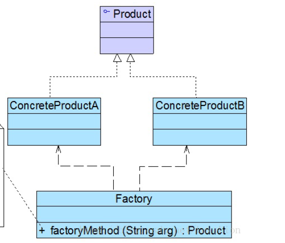

### 特点

工厂与产品是`一对多`的关系。

### 缺点

+ 工厂类集中了所有产品的创建逻辑；
+ 系统扩展困难，若新增产品，需要修改工厂类代码逻辑。

### 示例

```
abstract class Product {
    //所有产品类的公共业务方法
    public void methodSame() {
    //公共方法的实现
    }
    //声明抽象业务方法
    public abstract void methodDiff();
}
```

```
class ConcreteProduct extends Product {
	//实现业务方法
	public void methodDiff() {
	//业务方法的实现
	}
}
```

```
class Factory {
	//静态工厂方法
	public static Product getProduct(String arg) {
		Product product = null;
		if (arg.equalsIgnoreCase("A")) {
			product = new ConcreteProductA();
			//初始化设置product
		}
		else if (arg.equalsIgnoreCase("B")) {
			product = new ConcreteProductB();
			//初始化设置product
		}
		return product;
	}
}
```

```
class Client {
	public static void main(String args[]) {
		Product product;
		product = Factory.getProduct("A"); //通过工厂类创建产品对象
		product.methodSame();
		product.methodDiff();
	}
}
```

## 工厂方式模式

### 类图

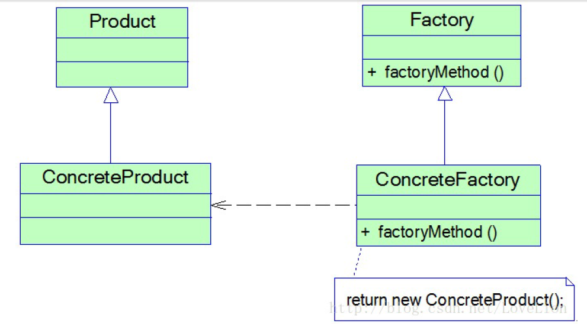

### 特点

工厂与产品是`一对一`的关系。

### 缺点

+ 添加新产品时，需要成对添加工厂类

### 示例

```
interface Factory {
	public Product factoryMethod();
}
```

```
class ConcreteFactory implements Factory {
	public Product factoryMethod() {
		return new ConcreteProduct();
	}
}
```

## 抽象工厂模式

### 类图

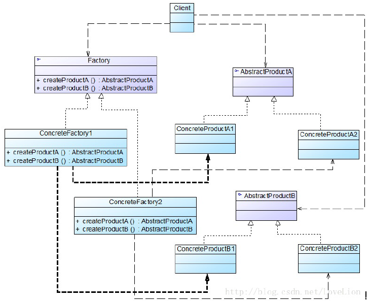

### 特点

工厂输出的是产品族

### 缺点

+ 修改工厂的产品族需要改动工厂代码逻辑

### 示例

```
abstract class AbstractFactory {
	public abstract AbstractProductA createProductA(); //工厂方法一
	public abstract AbstractProductB createProductB(); //工厂方法二
	……
}
```

```
class ConcreteFactory1 extends AbstractFactory {
	//工厂方法一
	public AbstractProductA createProductA() {
		return new ConcreteProductA1();
	}
	//工厂方法二
	public AbstractProductB createProductB() {
		return new ConcreteProductB1();
	}
	……
}
```

## 原型模式

### 使用场景

创建实例的成本比较高，通过`复制`现有的实例来创建新的实例

### 应用

对象的克隆

### 浅克隆

```
Object.clone()
```

### 深克隆

```
public WeeklyLog deepClone() throws IOException, ClassNotFoundException, {
	//将对象写入流中
	ByteArrayOutputStream bao=new ByteArrayOutputStream();
	ObjectOutputStream oos=new ObjectOutputStream(bao);
	oos.writeObject(this);
	//将对象从流中取出
	ByteArrayInputStream bis=new ByteArrayInputStream(bao.toByteArray());
	ObjectInputStream ois=new ObjectInputStream(bis);
	return (WeeklyLog)ois.readObject();
}
```

## 建造者模式

### 类图

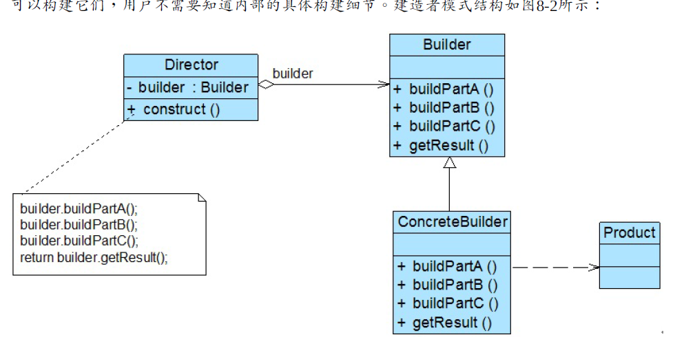

### 适用场景

+ 产品对象有复杂的内部结构，包含多个成员属性
+ 产品对象的属性相互依赖，有生成顺序

### 与`抽象工厂方式模式`的区别

+ 建造者模式：生成一个完整的负载产品
+ 抽象工厂方法模式：生成产品族（多个产品） 

### 示例

```
class Product {
	private String partA;
	private String partB;
	private String partC;
}
```

```
abstract class Builder {
	//创建产品对象
	protected Product product=new Product();
	public abstract void buildPartA();
	public abstract void buildPartB();
	public abstract void buildPartC();
	//返回产品对象
	public Product getResult() {
		return product;
	}
}
```

```
class Director {
	private Builder builder;
	public Director(Builder builder) {
		this.builder=builder;
	}
	public void setBuilder(Builder builder) {
		this.builder=builer;
	}
	//产品构建与组装方法
	public Product construct() {
		builder.buildPartA();
		builder.buildPartB();
		builder.buildPartC();
		return builder.getResult();
	}
}
```

```
Builder ab; //针对抽象建造者编程
ab = (ActorBuilder)XMLUtil.getBean(); //反射生成具体建造者对象
Director ac = new Director();
Product actor;
actor = ac.construct(ab);
```

## 模板方法模式

比如异步任务，定义了任务的执行、异常、成功等操作。

## 策略模式

定义了一系列策略，通常为接口的不同实现，业务场景自行决定采用哪种策略（实现）。

## 适配器模式

### 实际应用

+ Java JWT
+ Java IO
+ Spring Web MVC

### 特点

适配接口与被适配接口没有层次关系。如InputStream与Reader。

### 分类

#### 对象适配器模式

##### 类图

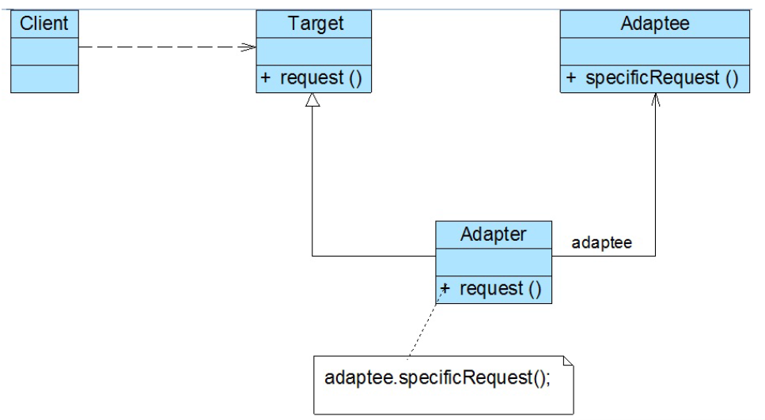

##### 示例

```
class Adapter extends Target {
	private Adaptee adaptee; //维持一个对适配者对象的引用
	public Adapter(Adaptee adaptee) {
		this.adaptee=adaptee;
	}
	public void request() {
		adaptee.specificRequest(); //转发调用
	}
}
```

#### 类适配器模式

##### 类图

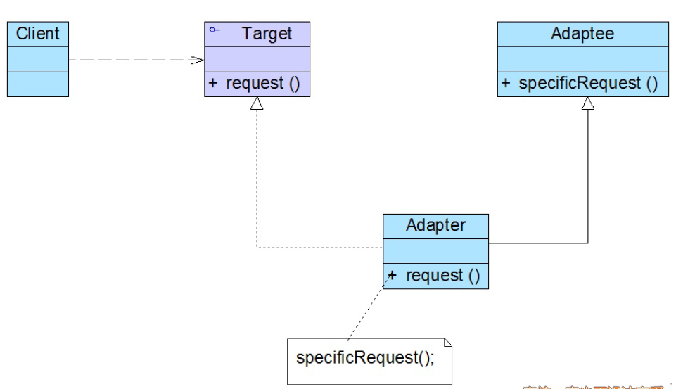

##### 示例

```
class Adapter extends Adaptee implements Target {
	public void request() {
		specificRequest();
	}
}
```

#### 双向适配器模式

##### 类图

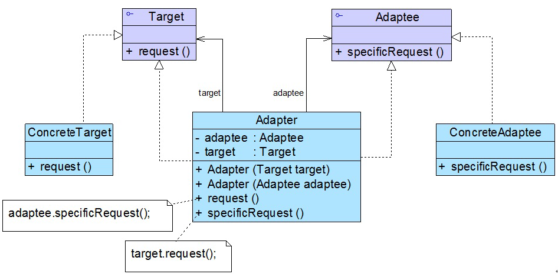

##### 示例

```
class Adapter implements Target,Adaptee {
    //同时维持对抽象目标类和适配者的引用
    private Target target;
	private Adaptee adaptee;
	public Adapter(Target target) {
		this.target = target;
	}
	public Adapter(Adaptee adaptee) {
		this.adaptee = adaptee;
	}
	public void request() {
		adaptee.specificRequest();
	}
	public void specificRequest() {
		target.request();
	}
}
```

#### 缺省适配器模式

##### 类图

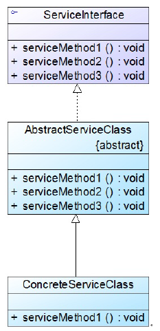

##### 特点

+ 缺省适配器（抽象类）中使用空方法实现接口声明的方法
+ 具体业务类只需要集成缺省适配器，重写需要的方法即可

## 桥接模式

### 类图

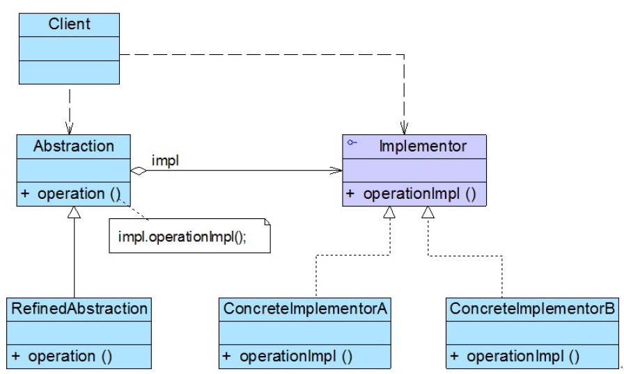

### 示例

```
interface Implementor {
	public void operationImpl();
}
```

```
abstract class Abstraction {
	protected Implementor impl; //定义实现类接口对象
	public void setImpl(Implementor impl) {
		this.impl=impl;
	}
	public abstract void operation(); //声明抽象业务方法
}
```

## 组合模式

### 类图

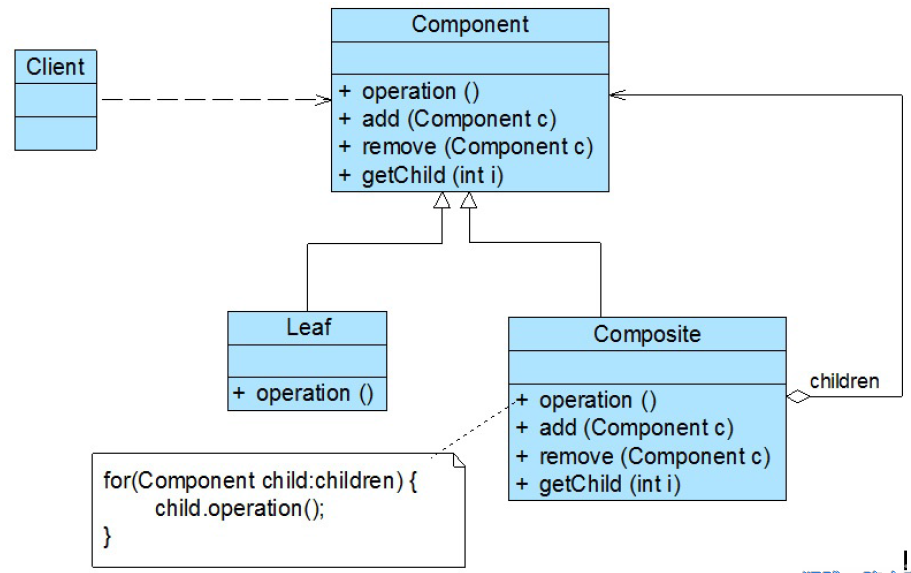

### 示例

```
abstract class Component {
	public abstract void add(Component c); //增加成员
	public abstract void remove(Component c); //删除成员
	public abstract Component getChild(int i); //获取成员
	public abstract void operation(); //业务方法
}
```

```
class Leaf extends Component {
	public void add(Component c) {
		//异常处理或错误提示
	}
	public void remove(Component c) {
		//异常处理或错误提示
	}
	public Component getChild(int i) {
		//异常处理或错误提示
		return null;
	}
	public void operation() {
		//叶子构件具体业务方法的实现
	}
}
```

```
class Composite extends Component {
	private ArrayList<Component> list = new ArrayList<Component>();
	public void add(Component c) {
		list.add(c);
	}
	public void remove(Component c) {
		list.remove(c);
	}
	public Component getChild(int i) {
		return (Component)list.get(i);
	}
	public void operation() {
		//容器构件具体业务方法的实现
		//递归调用成员构件的业务方法
		for(Object obj:list) {
			((Component)obj).operation();
		}
	}
}
```

## 装饰器模式

### 实际应用

+ JavaIO
+ Spring Web MVC

### 特点

装饰者与被装饰者有层次关系。如InputStream、FileInputStream。

### 类图

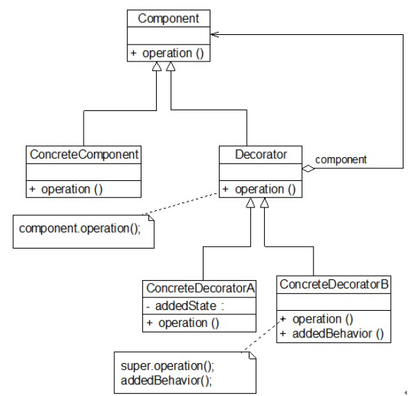

### 示例

```
class Decorator implements Component {
	private Component component; //维持一个对抽象构件对象的引用
	public Decorator(Component component) //注入一个抽象构件类型的对象
	{
		this.component=component;
	}
	public void operation() {
		component.operation(); //调用原有业务方法
	}
}
```

```
class ConcreteDecorator extends Decorator {
	public ConcreteDecorator(Component component) {
		super(component);
	}
	public void operation() {
		super.operation(); //调用原有业务方法
		addedBehavior(); //调用新增业务方法
	}
	//新增业务方法
	public void addedBehavior() {
		……
	}
}
```

## 外观模式

### 类图

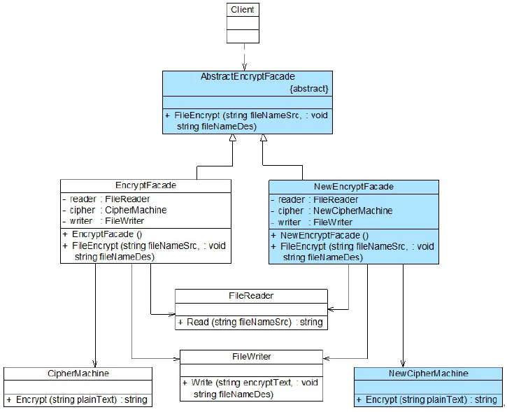

### 特点

屏蔽子组件，提供统一对外入口

## 享元模式

### 实际应用

+ Integer缓存
+ String的intern()
+ ThreadLocal

### 类图

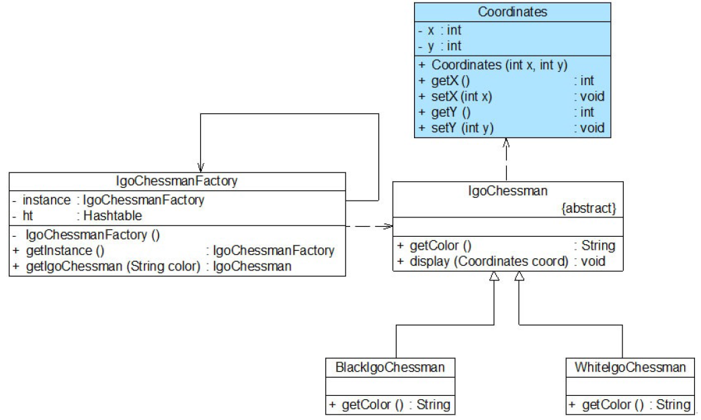

### 示例

```
class Flyweight {
	//内部状态intrinsicState作为成员变量，同一个享元对象其内部状态是一致的
	private String intrinsicState;
	public Flyweight(String intrinsicState) {
		this.intrinsicState=intrinsicState;
	}
	//外部状态extrinsicState在使用时由外部设置，不保存在享元对象中
	public void operation(String extrinsicState) {
		......
	}
}
```

### 特点

共享常用的对象，减少对象的创建

## 代理模式

### 类图

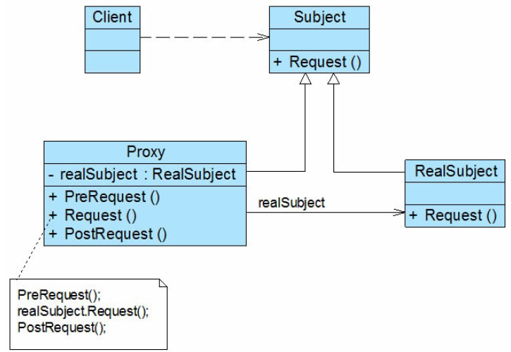

### 示例

```
abstract class Subject {
    public abstract void Request();
}
```

```
class RealSubject : Subject {
    public override void Request() {
        //业务方法具体实现代码
    }
}
```

```
class Proxy : Subject {
    private RealSubject realSubject = new RealSubject(); 
    //维持一个对真实主题对象
    public void PreRequest() {
        …...
    }
    public override void Request() {
        PreRequest();
        realSubject.Request(); //调用真实主题对象的方法
        PostRequest();
    }
    public void PostRequest() {
        ……
    }
}
```

## 责任链模式

### 类图

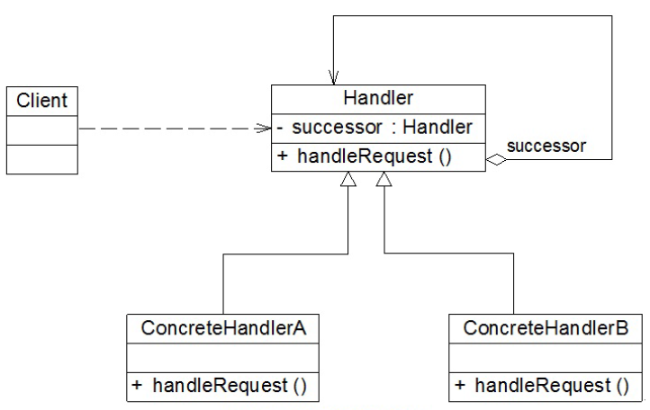

### 应用

+ Filter
+ Netty的handler

### 示例

```
abstract class Handler {
	//维持对下家的引用
	protected Handler successor;
	public void setSuccessor(Handler successor) {
		this.successor=successor;
	}
	public abstract void handleRequest(String request);
}
```

```
class ConcreteHandler extends Handler {
	public void handleRequest(String request) {
		if (请求满足条件) {
			//处理请求
		} else {
			this.successor.handleRequest(request); //转发请求
		}
	}
}
```

## 命令模式

将`请求`封装成对象，支持可撤销的操作，实现请求发送者与接收者的解耦。

### 类图

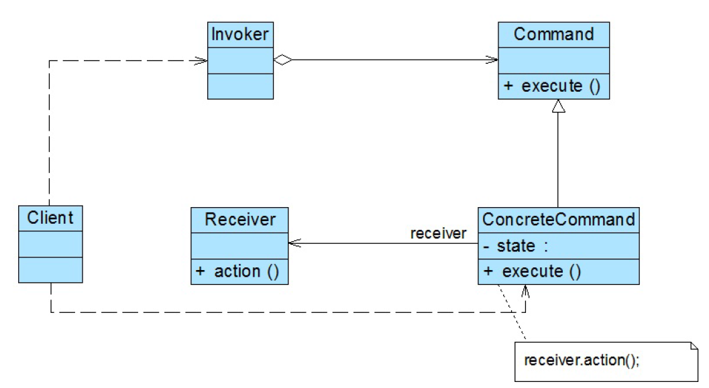

### 示例

```
abstract class Command {
    public abstract void execute();
}
```

```
class Invoker {
    private Command command;
    //构造注入
    public Invoker(Command command) {
        this.command = command;
    }
    //设值注入
    public void setCommand(Command command) {
        this.command = command;
    }
    //业务方法，用于调用命令类的execute()方法
    public void call() {
        command.execute();
    }
}
```

```
class ConcreteCommand extends Command {
    private Receiver receiver; 
    //维持一个对请求接收者对象的引用
    public void execute() {
        receiver.action(); //调用请求接收者的业务处理方法action()
    }
}
```

```
class Receiver {
    public void action() {
        //具体操作
    }
}
```