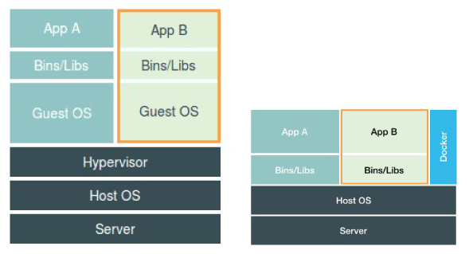

# docker

## 常用命令

### 查看版本

```
docker version
```

### 启动docker

```
systemctl start docker
```

### 重启docker

```
systemctl restart docker
```

### 查询docker容器在宿主机对应的进程ID

```
docker inspect -f '{{.State.Pid}}' <containerid>
```

查询连接数还可继续执行下面的命令：

```
nsenter -t <pid> -n netstat | grep ESTABLISHED
```

### 查看日志

```
docker logs --tail=<num> <container-id>
```

### 构建镜像

```
docker build -t <image-name> <dockerfile-dir>
```

### 启动镜像

```
docker run -p -d <host-port>:<conatiner-port> <image-name>
```

注：`-d`是后台运行参数

### 查看本地镜像

```
docker images
```

### 进入运行中的容器内部

```
docker exec -it <container-id> bash
```

> 注：可用`exit`命令退出

### 挂载容器目录至宿主机

```
docker run -d -v <container-path> <image-name>
```

### 停止容器

```
docker stop <container-id>
```

### 删除容器

必须是`停止`状态

```
docker rm <container-id>
```

### 删除镜像

没有容器存在，包括`停止`状态

```
docker rmi <image-id>
```

### 下载镜像到本地

实际上走的是`HTTP/HTTPS`协议

```
docker pull
```

## 进程

PID=1进程

实际上是宿主机的非1号进程，利用namespace技术进行隔离，该进程也是其他后续创建的所有进程的父进程。

不能同时运行两个不同的应用，但可以使用systemd、tomcat等作为容器的启动进程来跑多应用。

## 与虚拟机区别



## 操作系统内核

容器只是运行在宿主机上的一种特殊进程，多个容器之间使用的还是同一个宿主机的操作系统内核。

不能在低版本的Linux宿主机上运行高版本的linux容器，也不能在windows宿主机上运行Linux容器。

## 资源限制

### 技术底层

`cgroups`，限制进程使用的CPU、磁盘、内存、网络带宽等。

目录`/sys/fs/cgroup/cpu/docker/<container-id>/`下存在文件`cpu.cfs_quota_us`（-1表示不限制）和`cpu.cfs_period_us`

## 缺陷

### 修复容器中的top指令以及/proc文件系统中的信息？

把宿主机的 /var/lib/lxcfs/proc/* 文件挂载到容器的/proc/* 

## 根文件系统 `rootfs`

只是一个操作系统所包含的文件。配置、目录，不包括内核。

### 分层镜像设计（增量）

#### 底层

联合挂载

+ Ubuntu：AuFS、overlayfs
+ CentOs：device mapper、overlayfs

#### 分层

每一层其实都是操作系统的一部分，相同的文件上层会覆盖掉下层。


##### 只读层（readonly+whiteout）

##### Init层

+ 专门用来存放 /etc/hosts、/etc/resolv.conf等信息。
+ 这些文件本身属于只读层的部分，但是用户一般在启动容器时写入一些指定的值，且只对当前容器有效，而不会在执行docker commit时连同可读写层一起提交。

##### 可写读层（read+write）

+ 没有写入文件时，该目录为空。
+ 若为删除只读层的文件，实际上是创建了相应的.wh.{filename}的文件，与只读层联合挂载后，对应文件就会被.wh.{filename}文件"遮挡"起来。

## 运行中的linux容器

### 容器镜像

一组联合挂载在`/var/lib/docker/aufs/mnt`上的`rootfs`

### 容器运行时

由`namespace`+`cgroups`组成的隔离环境

## 安装

### 常见问题

#### Cannot connect to the Docker daemon. Is the docker daemon running on this host？

（1）执行下面命令

```
ps -ef | grep docker
```
检查docker进程是否在运行

（2）执行下面命令

```
sudo gpasswd -a ctgae docker
```
将当前用户添加到docker用户组去

#### 设置开机启动docker

```
su root # 先切换到root用户, 再执行以下命令
systemctl enable docker # 开机自动启动docker
```

### windows7安装Docker ToolBox

下载 [阿里云镜像](http://mirrors.aliyun.com/docker-toolbox/windows/docker-toolbox/)

安装后启动`Docker Quickstart Terminal`，可能需要去下载最新的[boot2docker](https://github.com/boot2docker/boot2docker/releases)，下载成功之后，将iso文件复制到`C:\Users\jirt\.docker\machine\cache`，然后再重新启动`Docker Quickstart Terminal`。

> 默认登录账号密码：docker/tcuser。

#### 设置HTTP访问镜像仓库

通过shell登录到docker虚机，编辑docker配置文件

```
sudo chmod +w /var/lib/boot2docker/profile
sudo vi /var/lib/boot2docker/profile
```

找到`EXTRA_ARGS`，输入：

```
--insecure-registry=ip:port
```

重启docker：

```
sudo systemctl restart docker
```

