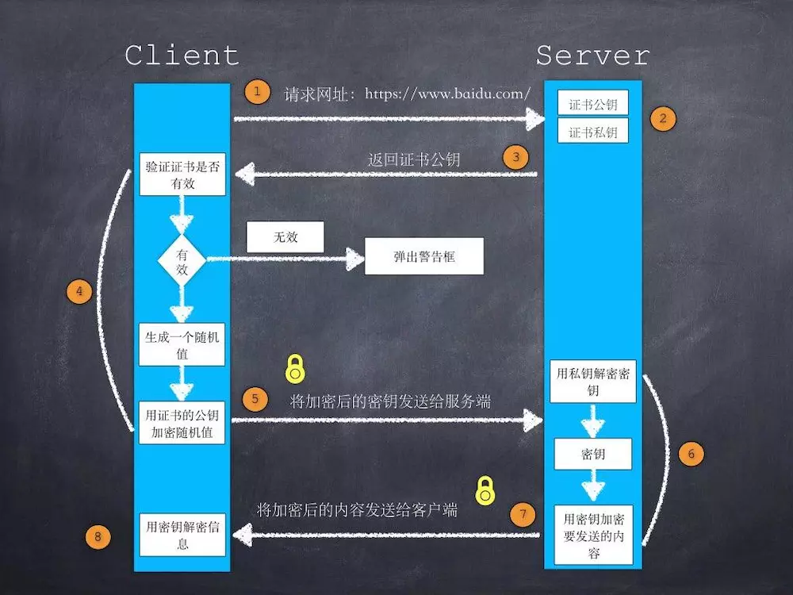
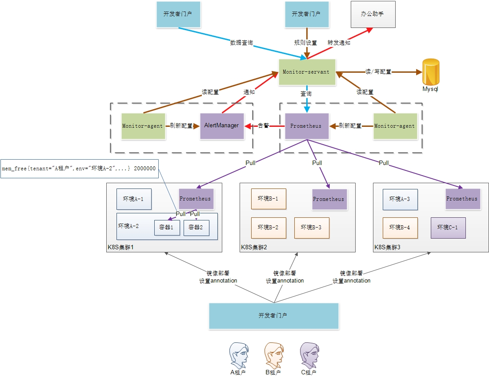

# 面试题

## 数据结构与算法

### hash的负载因子为什么这么定义

+ 负载因子过大，比如设置为1.0时，虽然空间利用率上去了，但是时间效率降低了。
+ 负载因子太小，比如设置为0.5时，虽然时间效率提升了，但是空间利用率降低了。

### 快速排序是怎么快速的

+ 比较跟交换的次数较少
+ 基于顺序访问，优于随机访问

### 快速排序与堆排序的对比

+ 平均时间上，堆排序的时间常数比快排要大一些，因此通常会慢一些，但是堆排序最差时间也是O(nlogn)的，这点比快排好。
+ 快速排序的交换次数少，且基于顺序访问

### 快速排序的时间复杂度、空间复杂度

O(nlogn)、O(logn~n)

## java

### ArrayList与LinkedList的区别

### HashMap1.7跟1.8区别

### HashMap链表与红黑树是如何转换的

### HashMap的数据结构

### concurrentHashMap7和8的底层实现差异

### 红黑树的优点

### JMM模型

### jvm排查思路及常用命令

### jvm内存模型

### jvm中的新生代与老年代

### jvm的垃圾回收算法

### jvm的垃圾收集器

### java8的新特性

### nio

### 如何保证线程安全

+ synchronized
+ volatile
+ 用原子类代替基本数据类型
+ ThreadLocal

### 并行与并发的区别

### synchronous的锁升级

### synchronized的字节码实现

### synchronized与Lock区别及其性能

+ synchronized：JVM实现，可重入，非公平锁
+ Lock：需要显示解锁，可重入，公平锁/非公平锁

### 自旋锁的理解

### 阻塞队列的使用场景

### volatile的作用

+ 保证变量的可见性
+ 禁用指令重排序

### volatile禁用指令重排序的底层实现

使用了一个CPU指令：内存屏障（Memory Barrier），通过插入内存屏障禁止在内存屏障前后的指令执行重排序优化。

### 为什么使用spring

### spring动态代理的实现原理

### JDK动态代理为什么不支持类

### spring如何解决循环依赖

### spring的依赖注入的理解

### aop注解失效的场景

### spring的aop的应用场景

### springboot的启动流程

### spring bean有哪些种类

+ spring直接创建bean实例
+ FactoryBean：特殊bean，具有工厂生成对象的能力，只能生产特定的对象。

### beanFactory与factoryBean的区别

+ FactoryBean是一个特殊的Bean，用于生成特定的Bean
+ BeanFactory是一个工厂，用于生产普通Bean

## beanFactory与ApplicationContext区别

+ beanFactory：Spring里面最低层的接口，提供了最简单的容器的功能，只提供了实例化对象和拿对象的功能
+ ApplicationContext：应用上下文，继承BeanFactory接口，它是Spring的一各更高级的容器，提供了更多的有用的功能。

### bloom过滤器的实现原理

### 如何保证接口的幂等性

### 缓存的使用场景

### 如何保证分布式事务

## 数据库

### 数据库表设计的基本原则

### MyIsam与InnoDb的区别

+ 事务处理：MyIsam不支持事务
+ 锁机制不同：MyISAM是表级锁，而InnoDB是行级锁
+ 外键支持：MyIsam不支持外键
+ MyISAM会比Innodb的查询速度快

### mysql事务的实现原理

### b+树的优点

### 索引的数据结构  

### 什么是聚簇索引  

### 主键索引与普通索引的差别

### a>1 b=1 c=1能否用到索引a b c

## 网络

### 网络七层协议

+ 应用层：针对特定应用的协议，常见的有Telnet、ssh、http、ftp等
+ 表示层：设备固有数据格式和网络标准数据格式的转换。表示层的数据转换包括数据的加密、压缩、格式转换等。
+ 会话层：管理主机之间的会话进程，即负责建立、管理、终止进程之间的会话。
+ 传输层：管理啊两个节点之间的数据传输，常见的有tcp、udp。端口地址，如HTTP对应80端口。差错校验、流量控制。
+ 网络层：地址管理与路由选择。流量控制，IP地址，形成IP包。
+ 数据链路层：互联设备之间传送和识别数据帧。成帧，保证帧的无误传输，MAC地址。
+ 物理层：规定了激活、维持、关闭通信端点之间的机械特性、电气特性、功能特性以及过程特性；该层为上层协议提供了一个传输数据的物理媒体。物理接口规范，传输比特流,网卡是工作在物理层的。

### http的keepalive参数

### tcp的keepalive与滑动窗口

### tcp为什么需要四次挥手

### tcp连接中出现大量TIME_WAIT的原因

### tcp与udp的区别

### tcp三次握手、四次松手的过程

### tcp为什么是三次握手的

3次握手完成两个重要的功能，既要双方做好发送数据的准备工作(双方都知道彼此已准备好)，也要允许双方就初始序列号进行协商，这个序列号在握手过程中被发送和确认。

现在把三次握手改成仅需要两次握手，死锁是可能发生的。作为例子，考虑计算机S和C之间的通信，假定C给S发送一个连接请求分组，S收到了这个分组，并发 送了确认应答分组。按照两次握手的协定，S认为连接已经成功地建立了，可以开始发送数据分组。可是，C在S的应答分组在传输中被丢失的情况下，将不知道S 是否已准备好，不知道S建立什么样的序列号，C甚至怀疑S是否收到自己的连接请求分组。在这种情况下，C认为连接还未建立成功，将忽略S发来的任何数据分 组，只等待连接确认应答分组。而S在发出的分组超时后，重复发送同样的分组。这样就形成了死锁。

### https的加密（握手）过程



### https协议怎么保证安全性

### https中的GET是否是安全的

## Linux

### 进程与线程的区别

### 进程间通信方式

+ 无名管道（pipe）：
（1）它是半双工的（即数据只能在一个方向上流动），具有固定的读端和写端。
（2）它只能用于具有亲缘关系的进程之间的通信（也是父子进程或者兄弟进程之间）。
（3）它可以看成是一种特殊的文件，对于它的读写也可以使用普通的read、write 等函数。但是它不是普通的文件，并不属于其他任何文件系统，并且只存在于内存中。
+ 有名队列：类似于在进程中使用文件来传输数据。
+ 消息队列：内核提供的一种数据结构。
+ 信号量：计数器，用于实现进程间的互斥与同步，而不是用于存储进程间通信数据。
+ 共享内存：指两个或多个进程共享一个给定的存储区。
+ 套接字
+ 信号

### 线程间通信方式

+ volatile、static：共享内存的思想。
+ 使用Object类的wait()和notify()方法
+ 使用JUC工具类CountDownLatch

### 内存管理模型

### 虚拟内存

虚拟内存是计算机系统内存管理的一种技术。它使得应用程序认为它拥有连续的可用的内存（一个连续完整的地址空间），而实际上，它通常是被分隔成多个物理内存碎片，还有部分暂时存储在外部磁盘存储器上，在需要时进行数据交换。

## 监控

### 监控中心的选型

当时的需求点：

+ 基本需求（主机和应用数据采集、自定义告警规则、数据查询）
+ 通知发办公助手（自定义通知渠道）
+ 开发量少（插件多，规范好）
+ 配置灵活

主流监控框架对比：

+ Zabbix：由服务端决定要采集什么数据
+ Open-falcon：由客户端决定要采集什么数据，小米开源，社区活跃度低，组件多，部署复杂
+ Prometheus：由客户端决定要采集什么数据，Google开源，社区活跃度高，与k8s生态结合紧密

### 架构图



# 笔试题

## 查找数组中2个元素之和等于目标值的下标，假定只有一对满足要求。

### 解法一

穷举

### 解法二：hash映射

```
public static int[] testArith() {
        int[] arr = {12, 14, 18, 20};
        HashMap<Integer, Integer> hashMap = new HashMap<>();
        int target = 32;

        for (int i = 0; i < arr.length; i++) {
            int value = target - arr[i];
            if (hashMap.containsKey(value)) {
                return new int[]{hashMap.get(value), i};
            }
            hashMap.put(arr[i], i);
        }

        return null;

    }
```

## 反转一个单链表。

```
public ListNode reverseList(ListNode head) {
        ListNode cur = head;
        ListNode newHead = null;
        ListNode prev = null;
        while (cur!=null) {
            ListNode curNext = cur.next;
            if (curNext==null) {
                newHead = cur;
            }
            cur.next = prev;
            prev = cur;
            cur = curNext;
        }
        return newHead;
    }

```

## 判断一个字符串是否合法，该字符串只含有{}()[]。

```
public boolean isValid(String s) {
       Stack<Character> stack = new Stack<Character>();
       for(char c:s.toCharArray()){
           if(c=='('){
               stack.push(')');
           }else if(c== '{'){
               stack.push('}');
           }else if(c=='['){
               stack.push(']');
           }else if(stack.isEmpty() || c!=stack.pop()){
               return false;
           }
       }
       return stack.isEmpty();
}
```

## 用两个栈实现队列

```
void push(int node) {
	stack1.push(node);
}

int pop() {
	int ret;
	
	if (stack2.empty()) {
			while(!stack1.empty()) {
			stack2.push(stack1.top());
			stack1.pop();
		}
	}
	
	ret = stack2.top();
	stack2.pop();
	
	return ret;
}
```

## 有一个包含了负数、0、正数的数组，找到子数组之和的最大值

```
int compare(int a[N]){
 int sum=0;
 int x=0;
 for(int i=0;i<N;i++){
  if(x<0)
   x=a[i];
  else
   x=x+a[i];
  if(sum<x)
   sum=x;
 }
 return sum;
}
```

## 合并多个有序数组为一个有序数组，并计算其时间复杂度

### 堆排序思想

+ 1. 创建一个大小为n的数组保存最后的结果
+ 2. 创建一个大小为k的最小堆，堆中元素为k个数组中的每个数组的第一个元素
+ 3. 重复下列步骤n次：
（1）每次从堆中取出最小元素（堆顶元素），并将其存入输出数组中
（2）用堆顶元素所在数组的下一元素将堆顶元素替换掉，
（3）如果数组中元素被取光了，将堆顶元素替换为无穷大。每次替换堆顶元素后，重新调整堆

时间复杂度计算：每次调整最小堆的时间为logk，总共调整约n次，因此时间复杂度为nlogk。

```
import java.util.PriorityQueue;
import java.util.Arrays;
import java.util.Comparator;

public class SortedArraysMerge {
    static class Node {
        int value;
        int idx;

        public Node(int value, int idx) {
            this.value = value;
            this.idx = idx;
        }
    }

    public static int[] MergeArrays(int[][] arr) {
        int N = arr.length, L;
        if (N == 0)//此时传入数组为空
            return new int[0];
        else {//判断数组是否符合规范
            L = arr[0].length;
            for (int i = 1; i < N; i++)
                if (arr[i].length != L)
                    return new int[0]; //此时数组不规范
        }
        int[] result = new int[N * L];
        int[] index = new int[N];
        Arrays.fill(index, 0, N, 0);
        PriorityQueue<Node> queue = new PriorityQueue<Node>(new Comparator<Node>() {
            @Override
            public int compare(Node n1, Node n2) {
                if (n1.value < n2.value)
                    return -1;
                else if (n1.value > n2.value)
                    return 1;
                else
                    return 0;
            }
        });
        for (int i = 0; i < N; i++) {
            Node node = new Node(arr[i][index[i]++], i);
            queue.offer(node);
        }
        System.out.println("" + queue.size());
        int idx = 0;
        while (idx < N * L) {
            Node minNode = queue.poll();
            result[idx++] = minNode.value;
            if (index[minNode.idx] < L) {
                queue.offer(new Node(arr[minNode.idx][index[minNode.idx]], minNode.idx));
                index[minNode.idx]++;
            }
        }
        return result;
    }
}
```

### 归并排序思想

二叉树的高度为logk（2^height=k），每层的合并次数为2*(n/k)*(k/2)=n次，因此时间复杂度为nlogk。

## Find Peak Element（LeetCode）

```
A peak element is an element that is greater than its neighbors.

Given an input array nums, where nums[i] ≠ nums[i+1], find a peak element and return its index.

The array may contain multiple peaks, in that case return the index to any one of the peaks is fine.

You may imagine that nums[-1] = nums[n] = -∞.
```

> 该题目中，要查找的峰值一定存在。

### 线性遍历

```
public class Solution {
    public int findPeakElement(int[] nums) {
        for (int i = 0; i < nums.length - 1; i++) {
            if (nums[i] > nums[i + 1])
                return i;
        }
        return nums.length - 1;
    }
}
```

### 二分查找（递归法）

```
public class Solution {
    public int findPeakElement(int[] nums) {
        return search(nums, 0, nums.length - 1);
    }
    public int search(int[] nums, int l, int r) {
        if (l == r)
            return l;
        int mid = (l + r) / 2;
        if (nums[mid] > nums[mid + 1])
            return search(nums, l, mid);
        return search(nums, mid + 1, r);
    }
}
```

### 二分查找（迭代法）

```
public class Solution {
    public int findPeakElement(int[] nums) {
        int l = 0, r = nums.length - 1;
        while (l < r) {
            int mid = (l + r) / 2;
            if (nums[mid] > nums[mid + 1])
                r = mid;
            else
                l = mid + 1;
        }
        return l;
    }
}
```