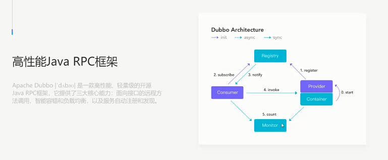
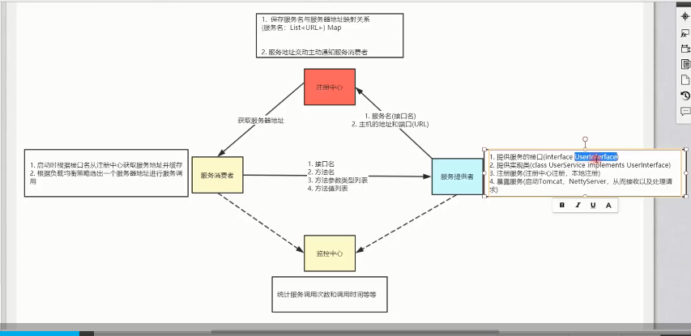
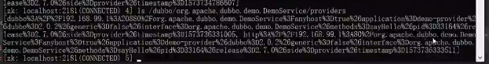
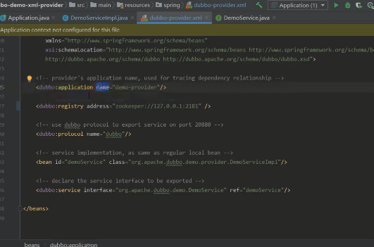
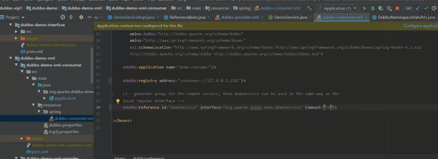

# dubbo

## 架构

## 注册中心

### 服务提供者注册到注册中心的信息

## 生产者

### 配置样例

## 消费者

### 配置样例

### 集群容器机制

+ Failover（默认）：失败自动切换，当出现失败，重试其他服务器。通常用于读操作，但重试会带来更长延迟。默认重试2次。
+ Failfast：快速失败，只发起一次调用，失败立即报错。通常用于非幂等性的写操作，如新增记录。
+ Failsafe：失败安全，出现异常时，直接忽略。通常用于写入审计日志等操作。
+ Failback：失败自动恢复，后台记录失败请求，定时重发，通常用于消息通知等操作。
+ Forking：并行调用多个服务器，只要一个成功即返回。通常用于实时性要求较高的读操作，但需要浪费更多服务资源。可通过forks="2"来设置最大并行数。
+ Broadcast：广播调用所有提供者，逐一调用，任意一台报错则报错。通常用于通知所有提供者更新缓存或日志等本地资源信息。

`MockInvoker`包装了`ClusterInvoker`，若调用失败（RpcException）则进入mock的逻辑。若以`force`开头，则强制进入`mock`逻辑。

消费者启动的时候会将注册中心上对应目录结构信息放到本地的`Directory`对象，调用的时候不需要再去查询注册中心。

