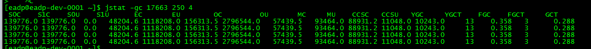
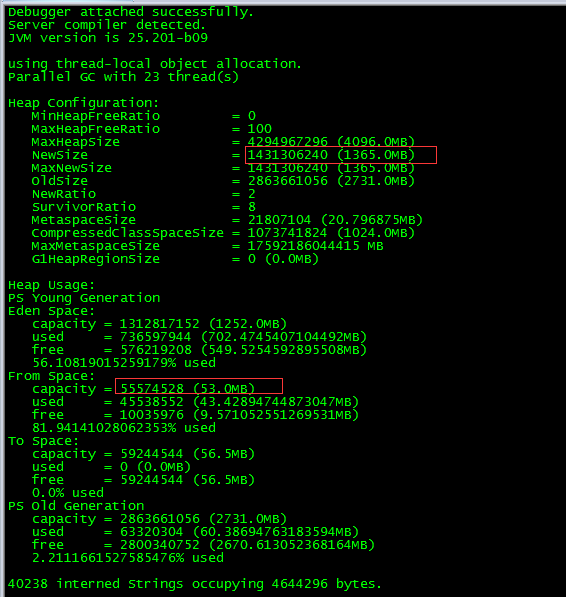
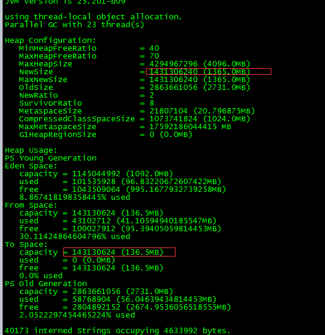
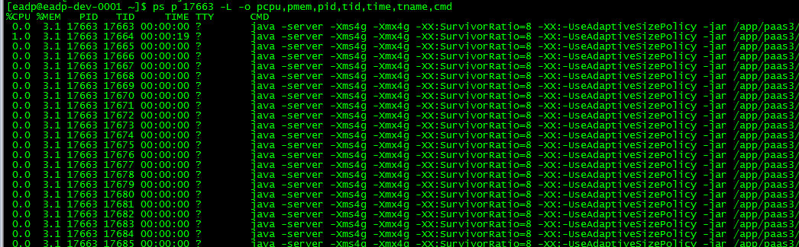
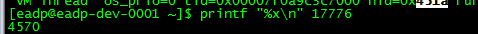
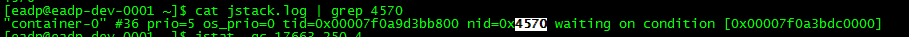

# jvm

## 内存结构

+ 程序计数器：线程私有的。
+ 虚拟机栈：线程私有的。
+ 本地方法栈：用于支持native方法的执行。
+ 堆区：所有线程共享。
+ 方法区：所有线程共享，存放了要加载的类的信息（如类名、修饰符等）、静态变量、构造函数、final定义的常量、类中的字段和方法等信息，以及常量池。

## 内存空间

+ jvm堆大小 = 新生代（Eden + 2Survivor） + 老年代
+ MetaSpace 包含 CompressedClassSpace

## 垃圾回收机制

### 可回收的内存

程序计数器、虚拟机栈、本地方法栈3个区域随线程而生、随线程而灭。因此垃圾回收关注的是堆区和方法区。

### 基础算法

#### 标记-清除算法

分为两个阶段：标记阶段和清除阶段。标记阶段的任务是标记出所有需要被回收的对象，清除阶段就是回收被标记的对象所占用的空间。

##### 缺点

容易产生内存碎片。

#### 复制算法

将可用内存按容量划分为大小相等的两块，每次只使用其中的一块。当这一块的内存用完了，就将还存活着的对象复制到另外一块上面，然后再把已使用的内存空间一次清理掉，这样一来就不容易出现内存碎片的问题。

##### 缺点

对内存空间的使用做出了高昂的代价，因为能够使用的内存缩减到原来的一半。

#### 标记-整理算法

分为两个阶段：标记阶段和清除阶段。标记阶段的任务是标记出所有需要被回收的对象，但是在完成标记之后，它不是直接清理可回收对象，而是将存活对象都向一端移动。

### 分代收集算法

#### 新生代（复制算法）

新生代一般分为一个Eden、2个survivor区，回收时先将eden区存活对象复制到一个survivor0区，然后清空eden区，当这个survivor0区也存放满了时，则将eden区和survivor0区存活对象复制到另一个survivor1区，然后清空eden和这个survivor0区，此时survivor0区是空的，然后将survivor0区和survivor1区交换，即保持survivor1区为空。当Eden没有足够空间的时候就会 触发jvm发起一次GC。

当survivor1区不足以存放 eden和survivor0的存活对象时，就将存活对象直接存放到老年代。若是老年代也满了就会触发一次Full GC(Major GC)，也就是新生代、老年代都进行回收。

#### 年老代（标记-整理算法）

当老年代内存满时触发Major GC即Full GC，Full GC发生频率比较低，老年代对象存活时间比较长，存活率标记高。

### 垃圾回收器

+ 串行：垃圾回收线程进行垃圾回收工作，此时用户线程处于等待状态。
+ 并发：用户线程与垃圾回收线程交替执行。
+ 并行：用户线程与垃圾回收线程分别在不同CPU上同时工作。

#### Serial/Serial Old收集器

+ 单线程收集器，进行垃圾收集时，必须暂停所有用户线程。
+ Serial收集器针对的是新生代，采用的是复制算法。
+ Serial Old收集器针对的是老年代，采用的是标记-整理算法。

#### ParNew收集器

Serial收集器的多线程版本。

#### Parallel Scavenge收集器

Parallel Scavenge收集器是一个新生代的多线程收集器（并行收集器），在回收期间不需要暂停其他用户线程，采用的是复制算法。追求的是高吞吐量、高效利用CPU。适合后台应用等对交互响应要求不高的场景。

#### Parallel Old收集器

Parallel Scavenge收集器的老年代版本，使用多线程和标记-整理算法。

#### CMS收集器

针对老年代，一种以获取最短回收停顿时间为目标的收集器（并发收集器），采用的是标记-清除算法。

#### G1收集器

面向服务端应用的收集器，并行与并发收集器。

## 常用命令

### 每隔1秒实时打印jvm信息

```
jstat -gcutil -h 20 <pid> 1000
```

```
jstat -gc <pid> 250 4
```



+ S0C、S1C、S0U、S1U：Survivor 0/1区容量（Capacity）和使用量（Used）
+ EC、EU：Eden区容量和使用量
+ OC、OU：年老代容量和使用量
+ MC、PU：MetaSpace容量和使用量
+ CCSC、CCSU：CompressedClassSpace容器和使用量
+ YGC、YGT：年轻代GC次数和GC耗时
+ FGC、FGCT：Full GC次数和Full GC耗时
+ GCT：GC总耗时

### 获取jvm当前存活对象信息

```
jmap -histo:live <pid>
```

### dump

```
jmap -dump:format=b,file=<dump-file> <pid>
```

### jcmd

需要先开启`NativeMemoryTracking`，开启之后有5-10%的性能损失。

```
-XX:NativeMemoryTracking=detail
```

# 性能调优实战

## 场景：使用-XX:SurvivorRatio=8不生效



答：在HotSpot VM里，ParallelScavenge系的GC（UseParallelGC / UseParallelOldGC）默认开启-XX:+UseAdaptiveSizePolicy， 这个配置会在每次Minor GC之后对From和To区进行自适应分配大小，而SurvivorRatio使用默认值8，设置成任何非8的数值都会无效。

解决办法：加上`-XX:-UseAdaptiveSizePolicy`。



## 场景：排查占用CPU/内存较多的线程

（1）打印进程中的线程

```
ps p <pid> -L -o pcpu,pmem,pid,tid,time,tname,cmd
```



（2）将线程ID转化为十六进制

```
printf "%x\n" <tid>
```



（3）打印jvm内线程信息

```
jstack -l <pid> > jstack.log
```

（4）根据jstack结果找到对应线程

```
cat jstack.log | grep <线程ID的十六进制>
```

