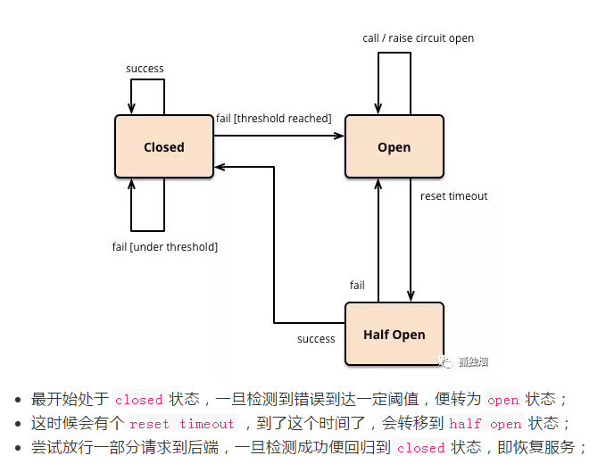
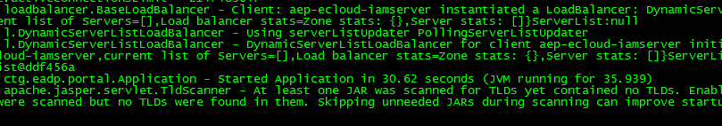
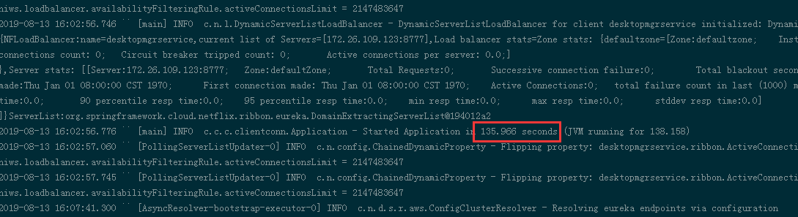

# spring cloud

## spring boot 配置文件读取优先级

+ （1）命令行参数：默认会把以“--”开头的命令行参数转化成应用中可以使用的配置参数，如 “--name=Alex” 会设置配置参数 “name” 的值为 “Alex”。如果不需要这个功能，可以通过 “SpringApplication.setAddCommandLineProperties(false)” 禁用解析命令行参数。
+ （2）通过 System.getProperties() 获取的 Java 系统参数。
+ （3）操作系统环境变量。
+ （4）从 java:comp/env 得到的 JNDI 属性。
+ （5）通过 RandomValuePropertySource 生成的“random.*”属性。
+ （6）应用 Jar 文件之外的属性文件。(通过spring.config.location参数)
+ （7）应用 Jar 文件内部的属性文件：properties文件优先级高于yaml文件
+ （8）在应用配置 Java 类（包含“@Configuration”注解的 Java 类）中通过@PropertySource注解声明的属性文件。
+ （9）通过“SpringApplication.setDefaultProperties”声明的默认属性。

> 注： jar包外部的配置文件可放置于执行`java -jar`命令的`config`相对目录下

## spring boot与传统spring相比有什么优点

+ 创建独立Spring应用程序
+ 嵌入式Tomcat，Jetty容器，无需部署WAR包
+ 简化Maven及Gradle配置
+ 尽可能的自动化配置Spring
+ 直接植入产品环境下的实用功能，比如度量指标、健康检查及扩展配置等
+ 无需代码生成及XML配置

## zookeeper与eureka的区别

一个分布式系统不可能同时满足C(一致性)、A(可用性)和P(分区容错性)。由于分区容错性在是分布式系统中必须要保证的，因此我们只能在A和C之间进行权衡。在此Zookeeper保证的是CP, 而Eureka则是AP。

### zookeeper

当master节点因为网络故障与其他节点失去联系时，剩余节点会重新进行leader选举。问题在于，选举leader的时间太长，30 ~ 120s, 且选举期间整个zk集群都是不可用的，这就导致在选举期间注册服务瘫痪。在云部署的环境下，因网络问题使得zk集群失去master节点是较大概率会发生的事，虽然服务能够最终恢复，但是漫长的选举时间导致的注册长期不可用是不能容忍的。

### eureka

Eureka各个节点都是平等的，几个节点挂掉不会影响正常节点的工作，剩余的节点依然可以提供注册和查询服务。而Eureka的客户端在向某个Eureka注册或时如果发现连接失败，则会自动切换至其它节点，只要有一台Eureka还在，就能保证注册服务可用(保证可用性)，只不过查到的信息可能不是最新的(不保证强一致性)。

## 注册中心与nginx有什么区别？

一个做服务端负载均衡，一个做客户端负载均衡

## 服务熔断

当下游的服务因为某种原因突然变得不可用或响应过慢，上游服务为了保证自己整体服务的可用性，不再继续调用目标服务，直接返回，快速释放资源。如果目标服务情况好转则恢复调用。



## 服务降级

+ 当下游的服务因为某种原因响应过慢，下游服务主动停掉一些不太重要的业务，释放出服务器资源，增加响应速度！
+ 当下游的服务因为某种原因不可用，上游主动调用本地的一些降级逻辑，避免卡顿，迅速返回给用户！

> 注：服务熔断可以看成是服务降级的一种处理方式。

## springboot启动慢原因追踪

### 部署在普通centos机器上，发现启动速度多达300多秒？



重启tomcat之后，打印进程的线程栈

```
jstack -l <pid>
```

发现下面信息：

```
"main" #1 prio=5 os_prio=31 tid=0x00007fe0e1000000 nid=0x2503 runnable [0x000070000b9c3000]
   java.lang.Thread.State: RUNNABLE
        at java.net.Inet6AddressImpl.lookupAllHostAddr(Native Method)
        at java.net.InetAddress$2.lookupAllHostAddr(InetAddress.java:928)
        at java.net.InetAddress.getAddressesFromNameService(InetAddress.java:1323)
        at java.net.InetAddress.getLocalHost(InetAddress.java:1500)
        - locked <0x00000007403c92a0> (a java.lang.Object)
        at sun.management.VMManagementImpl.getVmId(VMManagementImpl.java:140)
        at sun.management.RuntimeImpl.getName(RuntimeImpl.java:59)
```

简单来说就是，spring boot启动时，有些框架或者日志组件，会直接或间接地多次调用：`java.net.InetAddress.getLocalHost()`，这个调用在某些操作系统会阻塞很久。

#### 解决

查看机器的`hostname`

```
cat /etc/hostname
```

将机器的`hostname`添加至`hosts`

```
vim /etc/hosts
```

举例：

```
127.0.0.1   localhost localhost.localdomain localhost4 localhost4.localdomain4 microservice-console-0001.novalocal
::1         localhost localhost.localdomain localhost6 localhost6.localdomain6 microservice-console-0001.novalocal
```

> 参考资料：https://www.jianshu.com/p/5e9560e05edf

### 部署至docker容器时，启动非常慢？

通过docker启动的springboot启动慢，启动时间共用135s



执行

```
jinfo -flags <pid>
```

当前进程的jvm参数如下：

```
VM Flags:
Non-default VM flags: -XX:CICompilerCount=18 -XX:CompressedClassSpaceSize=528482304 -XX:+HeapDumpOnOutOfMemoryError
-XX:HeapDumpPath=null -XX:InitialHeapSize=268435456 -XX:MaxHeapSize=536870912 -XX:MaxMetaspaceSize=536870912 -XX:Max
NewSize=178782208 -XX:MetaspaceSize=268435456 -XX:MinHeapDeltaBytes=524288 -XX:NewSize=89128960 -XX:OldSize=17930649
6 -XX:ThreadStackSize=1024 -XX:+UseCompressedClassPointers -XX:+UseCompressedOops -XX:+UseFastUnorderedTimeStamps -X
X:+UseParallelGC
Command line:  -Xms256m -Xmx512m -Xss1024K -XX:MetaspaceSize=256m -XX:MaxMetaspaceSize=512m -XX:+HeapDumpOnOutOfMemo
ryError -XX:HeapDumpPath=/logs
```

从`CICompilerCount`参数看，这个值比较大达到了`18`

#### 解决

jdk8版本无法识别cgroup的限制，所以默认用宿主机的机器配置，来生成jvm默认的参数。

+ （1）升级`jdk8u221`及以上版本（推荐）
+ （2）jdk8比较旧的版本，显式设置指定参数
根据容器的cpu核数，显式设置以下参数：
例如：容器cpu核数为2，则明确GC和JIT并行线程数目，以避免二者占用过多资源
`-server -XX:ParallelGCThreads=2 -XX:CICompilerCount=2`