# 多线程与高并发

## runnable与callable区别

+ Callable规定的方法是call(),Runnable规定的方法是run().
+ Callable的任务执行后可返回值，而Runnable的任务是不能返回值
+ call方法可以抛出异常，run方法不可以
+ 运行Callable任务可以拿到一个Future对象，Future 表示异步计算的结果。它提供了检查计算是否完成的方法，以等待计算的完成，并获取计算的结果。计算完成后只能使用 get 方法来获取结果，如果线程没有执行完，Future.get()方法可能会阻塞当前线程的执行；如果线程出现异常，Future.get()会throws InterruptedException或者ExecutionException；如果线程已经取消，会跑出CancellationException。取消由cancel 方法来执行。isDone确定任务是正常完成还是被取消了。一旦计算完成，就不能再取消计算。

## 设计一个通用的高并发接口

### 做得少

（1）功能上，尽量不涉及一些难以缓存和预热的数据，比如用户ID。

+ 将活动ID作为KEY，存储成功秒杀用户ID的列表
+ 将个性化数据的功能在业务流程上后移

（2）处理信息量要少

控制接口的业务对象的数量级，若对象过多，可分次分批来处理。比如加上必要条件的筛选。

### 做的巧

（1）选择合理的业务实现方式

比如某类目下所有商品的最低价，实时读接口会比较耗时，可改为作业离线计算，计算结果写表。

（2）选择合理的缓存类型和缓存调用时机

## 秒杀实践

### 业务分析

+ 瞬时流量大
+ 参与用户多，可秒杀商品数量少
+ 请求读多写少
+ 秒杀状态转换实时性要求高

### 流程

#### 活动未开始

用户进入活动页，2种请求：一种加载活动页信息，一种查询活动状态得到未开始的结果。

#### 活动进行中

持续时间非常短，瞬时秒杀请求占比增高。

#### 活动结束

请求情况同活动开始前

### 缓存

（1）请求前端资源

varnish：将活动ID及城市ID作为KEY，缓存页面

（2）活动开始时间数据

ehcache：这个数据是一个较固定且不会发生变化的属性。

（3）剩余库存个数

memcached：全局需要一致，秒杀过程中变化非常快。

（4）秒杀队列

memcached：限制可参与秒杀的用户数量

（5）成功秒杀用户ID

redis：set结构保存

### 分库存

比如有500000个秒杀名额，分50份存储

## 并发编程

### 线程安全

#### 线程不安全的类如何在多线程环境使用？

实例封装（Java监视器模式）

（1）

将线程不安全的类封装到另一个对象，在对象加锁访问

（2）

```
public class PersonSet {
    
    private final Set<Person> mySet = new HashSet<>();
    
    public synchronized void addPerson(Person person) {
        mySet.add(person);
    }

    public synchronized boolean containsPerson(Person person) {
        return mySet.contains(person);
    }
    
}
```

（3）

```
public class PersonSet {

    private final Object myLock = new Object();
    Widget widget;

    void someMethod() {
        synchronized (myLock) {
            // 访问或修改widget的状态
        }
    }

}
```

#### 为现有的线程安全类添加原子方法？

（1）修改类的源码，以添加新的原子操作

（2）集成该线程安全类，并添加原子操作

```
public class ImprovedVector<T> extends Vector<T>{  
    public synchronized boolean putIfAbsent(T x){  
        boolean flag=contains(x);  
        if(!flag)  
             add(x);  
        return !flag;  
    }  
}  
```

（3）使用客户端加锁方式

```
public class ImprovedList<T>{  
    public List<T> list=Collections.synchronizedList(new ArrayList<T>());  
    public synchronized boolean putIfAbsent(T x){  
            synchronized(list){  
            boolean flag=list.contains(x);  
            if(!flag)  
                 list.add(x);  
            return !flag;  
        }  
    }  
}  
```

（4）使用组合方式（推荐）

```
public class ImprovedList<T> implements List<T>{  
    private final List<T> list;  
    public ImprovedList(List<T> list){  
         this.list=list;  
    }  
    public synchronized boolean putIfAbsent(T x){  
            boolean flag=list.contains(x);  
            if(!flag)  
                 list.add(x);  
            return !flag;  
        }  
    }  
    ...实现List<T>接口中的其他方法  
}  
```

### 锁

#### 不可重入锁

若当前线程执行某个方法已经获取了该锁，那么在方法中尝试再次获取锁时，就会获取不到被`阻塞`。

```
public class NonReentrantLock {

    private boolean isLocked = false;
    public synchronized void lock() throws InterruptedException{
        while(isLocked){
            wait();
        }
        isLocked = true;
    }
    public synchronized void unlock(){
        isLocked = false;
        notify();
    }
}
```

#### 可重入锁

线程可以进入它已经拥有的锁的同步代码块，有一个int型统计重入次数。

```
public class ReentrantLock {

    boolean isLocked = false;
    Thread  lockedBy = null;
    int lockedCount = 0;
    public synchronized void lock()
            throws InterruptedException{
        Thread thread = Thread.currentThread();
        while(isLocked && lockedBy != thread){
            wait();
        }
        isLocked = true;
        lockedCount++;
        lockedBy = thread;
    }
    public synchronized void unlock(){
        if(Thread.currentThread() == this.lockedBy){
            lockedCount--;
            if(lockedCount == 0){
                isLocked = false;
                notify();
            }
        }
    }
}
```

##### 应用

+ synchronized
+ java.util.concurrent.locks.ReentrantLock

### JDK线程安全类

#### 同步容器

`Collections.synchronizedXxx`

封装底层容器，并对每个公有方法都进行同步。

#### 并发容器

##### ConcurrentHashMap

+ 分段锁机制
+ size()、isEmpty()返回值不精确

###### HashMap

+ hash冲突>8时，将桶的链表转为红黑树，优化查询性能；
+ hash冲突<=6时，将桶的红黑树转化为链表。不设置为8是为了避免map在临界值8时频繁插入删除元素时红黑树与链表的转化。
+ 转化都在插入时进行。

##### CopyOnWriteArrayList（读写分离）

+ 往一个容器添加元素的时候，不直接往当前容器添加，而是先将当前容器进行Copy，复制出一个新的容器，然后新的容器里添加元素，添加完元素之后，再将原容器的引用指向新的容器。
+ 允许多线程遍历，遍历过程不会抛出ConcurrentModificationException 异常，底层是生成快照，读线程对各自的快照进行遍历。

###### 适用场景

适用于`读多写少`的并发场景：比如`白名单`，`黑名单`，商品类目的访问和更新场景，假如我们有一个搜索网站，用户在这个网站的搜索框中，输入关键字搜索内容，但是某些关键字不允许被搜索。这些不能被搜索的关键字会被放在一个黑名单当中，黑名单每天晚上更新一次。当用户搜索时，会检查当前关键字在不在黑名单当中，如果在，则提示不能搜索。

```
public class BlackListServiceImpl {

    private static CopyOnWriteMap<String, Boolean> blackListMap = new CopyOnWriteMap<String, Boolean>(1000);

    public static boolean isBlackList(String id) {
        return blackListMap.get(id) == null ? false : true;
    }

    public static void addBlackList(String id) {
        blackListMap.put(id, Boolean.TRUE);
    }
    
    /**
     * 批量添加黑名单
     *
     * @param ids
     */
    public static void addBlackList(Map<String,Boolean> ids) {
        
        blackListMap.putAll(ids);
        
    }

}
```

###### 缺点

+ 内存占用问题：在进行写操作的时候，内存里会同时驻扎两个对象的内存，旧的对象和新写入的对象。如果这些对象占用的内存比较大，那么有可能造成频繁的Yong GC和Full GC。
+ 数据一致性问题： 读到的数据可能已过时

##### BlockQueue

+ 提供可阻塞的put()、take()方法，适用于生产者-消费者模式
+ `LinkedBlockingQueue`：内部使用2个可重入锁`ReentrantLock`，分别用于入队、出队。保证了同一时刻只有一个线程入队/出队。

##### BlockDeque	

双端队列，适用于工作密取模式，每个消费者有自己的消费队列，消费完可去获取其他消费者队尾的工作，减少了竞争。

#### 同步工具类

##### Lacth（闭锁）

一次性对象，一旦到达终止状态，不可被重置。

`CountDownLatch`

```
public long timeTasks(int nThreads, final Runnable task) throws InterruptedException {
        final CountDownLatch startGate = new CountDownLatch(1);
        final CountDownLatch endGate = new CountDownLatch(nThreads);
        
        for (int i = 0; i < nThreads; i++) {
            Thread t = new Thread() {
                @Override
                public void run() {
                    try {
                        startGate.await();
                        try {
                            task.run();
                        } finally {
                            endGate.countDown();
                        }
                    } catch (InterruptedException e) {
                        
                    } 
                }
            };
            t.start();
        }
        
        long start = System.nanoTime();
        startGate.countDown();
        endGate.await();
        long end = System.nanoTime();
        return end - start;
    }
```

##### FutureTask

```
public class Preloader {
    private final FutureTask<ProductInfo> future = new FutureTask<ProductInfo>(new Callable<ProductInfo>() {
        @Override
        public ProductInfo call() throws Exception {
            return loadProductInfo();
        }
    });
    private final Thread thread = new Thread(future);
    
    public void start() {
        thread.start();
    }
    
    public ProductInfo get() throws InterruptedException {
        try {
            return future.get();
        } catch (ExecutionException e) {
            // ...
        }
    }
            
}
```

##### 信号量

控制同时访问某个特定资源的操作数量。

```
public class BoundedHashSet<T> {
    private final Set<T> set;
    private final Semaphore semaphore;

    public BoundedHashSet(int bound) {
        this.set = Collections.synchronizedSet(new HashSet<T>());
        semaphore = new Semaphore(bound);
    }

    public boolean add(T t) throws InterruptedException {
        semaphore.acquire();
        boolean wasAdded = false;
        try {
            wasAdded = set.add(t);
            return wasAdded;
        } finally {
            if (!wasAdded) {
                semaphore.release();
            }
        }
    }
    
    public boolean remove(Object o) {
        boolean wasRemoved = set.remove(o);
        if (wasRemoved) {
            semaphore.release();
        }
        return wasRemoved;
    }
}
```

##### Barrier（栅栏）

阻塞一组线程直到某个事件发生。

`CyclicBarrier`

在释放等待线程之后可以被重用。（与LatchLock有区别）

```
public class CyclicBarrierTest {

	public static void main(String[] args) throws IOException, InterruptedException {
		//如果将参数改为4，但是下面只加入了3个选手，这永远等待下去
		//Waits until all parties have invoked await on this barrier. 
		CyclicBarrier barrier = new CyclicBarrier(3);

		ExecutorService executor = Executors.newFixedThreadPool(3);
		executor.submit(new Thread(new Runner(barrier, "1号选手")));
		executor.submit(new Thread(new Runner(barrier, "2号选手")));
		executor.submit(new Thread(new Runner(barrier, "3号选手")));

		executor.shutdown();
	}
}

class Runner implements Runnable {
	// 一个同步辅助类，它允许一组线程互相等待，直到到达某个公共屏障点 (common barrier point)
	private CyclicBarrier barrier;

	private String name;

	public Runner(CyclicBarrier barrier, String name) {
		super();
		this.barrier = barrier;
		this.name = name;
	}

	@Override
	public void run() {
		try {
			Thread.sleep(1000 * (new Random()).nextInt(8));
			System.out.println(name + " 准备好了...");
			// barrier的await方法，在所有参与者都已经在此 barrier 上调用 await 方法之前，将一直等待。
			barrier.await();
		} catch (InterruptedException e) {
			e.printStackTrace();
		} catch (BrokenBarrierException e) {
			e.printStackTrace();
		}
		System.out.println(name + " 起跑！");
	}
}
```

## 极客时间

### 并发编程

+ 分工：将一个大任务拆分为多个小任务（偏业务），并交给多线程去执行（偏实现）
+ 同步：多线程间的通信
+ 互斥：保证同一时刻只有一个线程访问共享资源。常用工具为锁。

### 三大问题

+ 可见性：CPU缓存

```
public class Test {

    private long count = 0;

    public long getCount() {
        return count;
    }

    private void add10K() {
        int idx = 0;
        while(idx++ < 10000) {
            count += 1;
        }
    }

    public static long calc() throws InterruptedException {
        final Test test = new Test();
        // 创建两个线程，执行add()操作
        Thread th1 = new Thread(()->{
            test.add10K();
        });
        Thread th2 = new Thread(()->{
            test.add10K();
        });
        // 启动两个线程
        th1.start();
        th2.start();
        // 等待两个线程执行结束
        th1.join();
        th2.join();
        return test.getCount();
    }

    public static void main(String[] args) throws InterruptedException {
        long count = calc();
        System.out.println(count);
    }
}
```

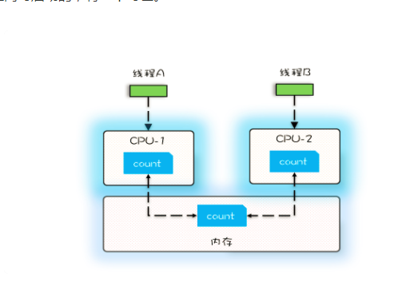

+ 原子性：线程切换，`CPU`能保证的原子操作是`CPU指令`级别的，而不是高级语言的操作符

+ 有序性：编译器为了优化性能，有时候会改变程序中指令的先后顺序

```

public class Singleton {
  static Singleton instance;
  static Singleton getInstance(){
    if (instance == null) {
      synchronized(Singleton.class) {
        if (instance == null)
          instance = new Singleton();
        }
    }
    return instance;
  }
}
```

我们以为的`new`操作应该是：

（1）分配一块内存M；
（2）在内存M上初始化Singleton对象；
（3）然后M的地址赋值给instance变量。

但是实际上优化后的执行路径却是这样的：

（1）分配一块内存M；
（2）将M的地址赋值给instance变量；
（3）最后在内存M上初始化Singleton对象

> 在java中`Long`类型是`64位`的，在`32位`的系统中，Cpu指令要进行多次操作，无法保证原子性。

### Happens-before原则

+ 程序的顺序性规则：前面一个操作的结果对后续操作是可见的。
+ volatile变量规则：对一个volatile变量的写操作，Happens-Before于后续对这个volatile变量的读操作。
+ 传递性：如果A`Happens-Before`B，且B`Happens-Before`C，那么A`Happens-Before`C。

```
class VolatileExample {
  int x = 0;
  volatile boolean v = false;
  public void writer() {
    x = 42;
    v = true;
  }
  public void reader() {
    if (v == true) {
      // 这里x会是多少呢？
    }
  }
}
```

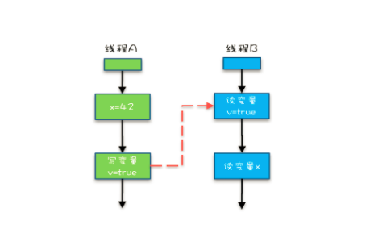

+ 管程中锁的规则：对一个锁的解锁`Happens-Before`于后续对这个锁的加锁。

> `synchronized`是Java里对管程的实现。

```

synchronized (this) { //此处自动加锁
  // x是共享变量,初始值=10
  if (this.x < 12) {
    this.x = 12; 
  }  
} //此处自动解锁
```

+ 线程start()规则：指主线程A启动子线程B后，子线程B能够看到主线程在启动子线程B前的操作。

```

Thread B = new Thread(()->{
  // 主线程调用B.start()之前
  // 所有对共享变量的修改，此处皆可见
  // 此例中，var==77
});
// 此处对共享变量var修改
var = 77;
// 主线程启动子线程
B.start();
```

+ 线程join()规则：如果在线程A中，调用线程B的join()并成功返回，那么线程B中的任意操作`Happens-Before`于该join()操作的返回。

```

Thread B = new Thread(()->{
  // 此处对共享变量var修改
  var = 66;
});
// 例如此处对共享变量修改，
// 则这个修改结果对线程B可见
// 主线程启动子线程
B.start();
B.join()
// 子线程所有对共享变量的修改
// 在主线程调用B.join()之后皆可见
// 此例中，var==66
```

### 死锁

4个必要条件：

+ 互斥，共享资源X和Y只能被一个线程占用；（无法破坏）
+ 占有且等待，线程T1已经取得共享资源X，在等待共享资源Y的时候，不释放共享资源X；
+ 不可抢占，其他线程不能强行抢占线程T1占有的资源；
+ 循环等待，线程T1等待线程T2占有的资源，线程T2等待线程T1占有的资源，就是循环等待。

破坏其他三个条件之一，即可解决`死锁`。

+ 占用且等待：我们可以一次性申请所有的资源，这样就不存在等待了。

```

class Allocator {
  private List<Object> als =
    new ArrayList<>();
  // 一次性申请所有资源
  synchronized boolean apply(
    Object from, Object to){
    if(als.contains(from) ||
         als.contains(to)){
      return false;  
    } else {
      als.add(from);
      als.add(to);  
    }
    return true;
  }
  // 归还资源
  synchronized void free(
    Object from, Object to){
    als.remove(from);
    als.remove(to);
  }
}

class Account {
  // actr应该为单例
  private Allocator actr;
  private int balance;
  // 转账
  void transfer(Account target, int amt){
    // 一次性申请转出账户和转入账户，直到成功
    while(!actr.apply(this, target))
      ；
    try{
      // 锁定转出账户
      synchronized(this){              
        // 锁定转入账户
        synchronized(target){           
          if (this.balance > amt){
            this.balance -= amt;
            target.balance += amt;
          }
        }
      }
    } finally {
      actr.free(this, target)
    }
  } 
}
```

+ 不可抢占：占用部分资源的线程进一步申请其他资源时，如果申请不到，可以主动释放它占有的资源，这样不可抢占这个条件就破坏掉了。

> `synchronized`做不到，可以用`java.util.concurrent`这个包下面提供的`Lock`。

+ 循环等待：可以靠按序申请资源来预防。所谓按序申请，是指资源是有线性顺序的，申请的时候可以先申请资源序号小的，再申请资源序号大的，这样线性化后自然就不存在循环了。

```

class Account {
  private int id;
  private int balance;
  // 转账
  void transfer(Account target, int amt){
    Account left = this        ①
    Account right = target;    ②
    if (this.id > target.id) { ③
      left = target;           ④
      right = this;            ⑤
    }                          ⑥
    // 锁定序号小的账户
    synchronized(left){
      // 锁定序号大的账户
      synchronized(right){ 
        if (this.balance > amt){
          this.balance -= amt;
          target.balance += amt;
        }
      }
    }
  } 
}
```

### 等待-通知机制

```

class Allocator {
  private List<Object> als;
  // 一次性申请所有资源
  synchronized void apply(
    Object from, Object to){
    // 经典写法
    while(als.contains(from) ||
         als.contains(to)){
      try{
        // 释放锁
        wait();
      }catch(Exception e){
      }   
    } 
    als.add(from);
    als.add(to);  
  }
  // 归还资源
  synchronized void free(
    Object from, Object to){
    als.remove(from);
    als.remove(to);
    notifyAll();
  }
}
```

> notify()是会随机地通知等待队列中的一个线程，而notifyAll()会通知等待队列中的所有线程。尽量使用notifyAll()，避免有些线程永远不会被通知。被唤醒后线程会去竞争锁，竞争成功后继续执行wait()之后的代码。

> wait()会释放锁。

> 只能在synchronized中使用。

### 性能的度量指标

+ 吞吐量：指的是单位时间内能处理的请求数量。吞吐量越高，说明性能越好。
+ 延迟：指的是从发出请求到收到响应的时间。延迟越小，说明性能越好。
+ 并发量：指的是能同时处理的请求数量，一般来说随着并发量的增加、延迟也会增加。所以延迟这个指标，一般都会是基于并发量来说的。例如并发量是 1000 的时候，延迟是 50 毫秒。

### 管程（Monitor）

管程和信号量是等价的，所谓等价指的是用管程能够实现信号量，也能用信号量实现管程。

指的是管理共享变量以及对共享变量的操作过程，让他们支持并发。

#### MESA模型

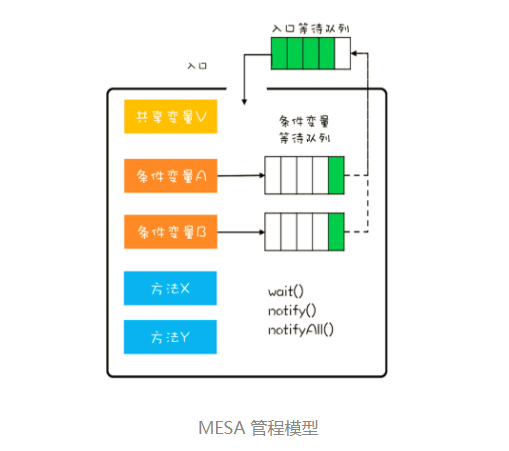

##### 编程范式

```
while(条件不满足) {
  wait();
}
```

##### 示例

```

public class BlockedQueue<T>{
  final Lock lock =
    new ReentrantLock();
  // 条件变量：队列不满  
  final Condition notFull =
    lock.newCondition();
  // 条件变量：队列不空  
  final Condition notEmpty =
    lock.newCondition();

  // 入队
  void enq(T x) {
    lock.lock();
    try {
      while (队列已满){
        // 等待队列不满 
        notFull.await();
      }  
      // 省略入队操作...
      //入队后,通知可出队
      notEmpty.signal();
    }finally {
      lock.unlock();
    }
  }
  // 出队
  void deq(){
    lock.lock();
    try {
      while (队列已空){
        // 等待队列不空
        notEmpty.await();
      }
      // 省略出队操作...
      //出队后，通知可入队
      notFull.signal();
    }finally {
      lock.unlock();
    }  
  }
}
```

#### JAVA简易实现

基于MESA模型，synchronized 关键字修饰的代码块，在编译期会自动生成相关加锁和解锁的代码，只支持一个条件变量。

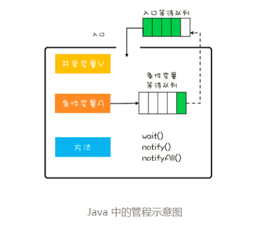

> wait()若加了超时的参数，超时后，会从条件变量的等待队列放入入口等待队列。

### 线程

#### 通用的生命周期

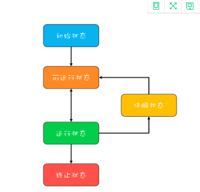

+ 初始状态，指的是线程已经被创建，但是还不允许分配 CPU 执行。这个状态属于编程语言特有的，不过这里所谓的被创建，仅仅是在编程语言层面被创建，而在操作系统层面，真正的线程还没有创建。
+ 可运行状态，指的是线程可以分配 CPU 执行。在这种状态下，真正的操作系统线程已经被成功创建了，所以可以分配 CPU 执行。
+ 当有空闲的 CPU 时，操作系统会将其分配给一个处于可运行状态的线程，被分配到 CPU 的线程的状态就转换成了运行状态。
+ 运行状态的线程如果调用一个阻塞的 API（例如以阻塞方式读文件）或者等待某个事件（例如条件变量），那么线程的状态就会转换到休眠状态，同时释放 CPU 使用权，休眠状态的线程永远没有机会获得 CPU 使用权。当等待的事件出现了，线程就会从休眠状态转换到可运行状态。
+ 线程执行完或者出现异常就会进入终止状态，终止状态的线程不会切换到其他任何状态，进入终止状态也就意味着线程的生命周期结束了。

#### Java中线程的生命周期

+ NEW（初始化状态）
+ RUNNABLE（可运行 / 运行状态）
+ BLOCKED（阻塞状态）
+ WAITING（无时限等待）
+ TIMED_WAITING（有时限等待）
+ TERMINATED（终止状态）

#### 创建线程的数量

##### IO密集型计算

I/O操作执行的时间相对于CPU计算来说都非常长

最佳线程数 = CPU 核数 * [ 1 +（I/O耗时 / CPU耗时）]

##### CPU密集型计算

线程数量 = CPU核数 + 1

### Lock

+ 能够响应中断。synchronized的问题是，持有锁A后，如果尝试获取锁B失败，那么线程就进入阻塞状态，一旦发生死锁，就没有任何机会来唤醒阻塞的线程。但如果阻塞状态的线程能够响应中断信号，也就是说当我们给阻塞的线程发送中断信号的时候，能够唤醒它，那它就有机会释放曾经持有的锁A。这样就破坏了不可抢占条件了。
+ 支持超时。如果线程在一段时间之内没有获取到锁，不是进入阻塞状态，而是返回一个错误，那这个线程也有机会释放曾经持有的锁。这样也能破坏不可抢占条件。
+ 非阻塞地获取锁。如果尝试获取锁失败，并不进入阻塞状态，而是直接返回，那这个线程也有机会释放曾经持有的锁。这样也能破坏不可抢占条件。

```
// 支持中断的API
void lockInterruptibly() 
  throws InterruptedException;
// 支持超时的API
boolean tryLock(long time, TimeUnit unit) 
  throws InterruptedException;
// 支持非阻塞获取锁的API
boolean tryLock();
```

实现上利用了`volatile`相关的Happens-Before规则来保证多线程的可见性，Java SDK里面的ReentrantLock，内部持有一个volatile的成员变量state。

#### 可重入锁（ReentrantLock）

线程可以重复获取同一把锁。

```

class X {
  private final Lock rtl =
  new ReentrantLock();
  int value;
  public int get() {
    // 获取锁
    rtl.lock();         ②
    try {
      return value;
    } finally {
      // 保证锁能释放
      rtl.unlock();
    }
  }
  public void addOne() {
    // 获取锁
    rtl.lock();  
    try {
      value = 1 + get(); ①
    } finally {
      // 保证锁能释放
      rtl.unlock();
    }
  }
}
```

#### 用锁的最佳实践

+ 永远只在更新对象的成员变量时加锁
+ 永远只在访问可变的成员变量时加锁
+ 永远不在调用其他对象的方法时加锁

### Condition

实现了管程模型里面的`条件变量`。

```

public class BlockedQueue<T>{
  final Lock lock =
    new ReentrantLock();
  // 条件变量：队列不满  
  final Condition notFull =
    lock.newCondition();
  // 条件变量：队列不空  
  final Condition notEmpty =
    lock.newCondition();

  // 入队
  void enq(T x) {
    lock.lock();
    try {
      while (队列已满){
        // 等待队列不满
        notFull.await();
      }  
      // 省略入队操作...
      //入队后,通知可出队
      notEmpty.signal();
    }finally {
      lock.unlock();
    }
  }
  // 出队
  void deq(){
    lock.lock();
    try {
      while (队列已空){
        // 等待队列不空
        notEmpty.await();
      }  
      // 省略出队操作...
      //出队后，通知可入队
      notFull.signal();
    }finally {
      lock.unlock();
    }  
  }
}
```

异步转同步示例

```

// 创建锁与条件变量
private final Lock lock 
    = new ReentrantLock();
private final Condition done 
    = lock.newCondition();

// 调用方通过该方法等待结果
Object get(int timeout){
  long start = System.nanoTime();
  lock.lock();
  try {
  while (!isDone()) {
    done.await(timeout);
      long cur=System.nanoTime();
    if (isDone() || 
          cur-start > timeout){
      break;
    }
  }
  } finally {
  lock.unlock();
  }
  if (!isDone()) {
  throw new TimeoutException();
  }
  return returnFromResponse();
}
// RPC结果是否已经返回
boolean isDone() {
  return response != null;
}
// RPC结果返回时调用该方法   
private void doReceived(Response res) {
  lock.lock();
  try {
    response = res;
    if (done != null) {
      done.signal();
    }
  } finally {
    lock.unlock();
  }
}
```

### 信号量（Semaphore）

Semaphore可以允许多个线程访问一个临界区。

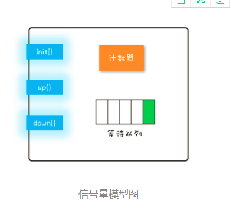

+ init()：设置计数器的初始值。
+ down()：计数器的值减1；如果此时计数器的值小于0，则当前线程将被阻塞，否则当前线程可以继续执行。对应Java SDK并发包里的acquire()。
+ up()：计数器的值加1；如果此时计数器的值小于或者等于0，则唤醒等待队列中的一个线程，并将其从等待队列中移除。对应Java SDK并发包里的release()。

```

class Semaphore{
  // 计数器
  int count;
  // 等待队列
  Queue queue;
  // 初始化操作
  Semaphore(int c){
    this.count=c;
  }
  // 
  void down(){
    this.count--;
    if(this.count<0){
      //将当前线程插入等待队列
      //阻塞当前线程
    }
  }
  void up(){
    this.count++;
    if(this.count<=0) {
      //移除等待队列中的某个线程T
      //唤醒线程T
    }
  }
}
```

#### 限流器

```

class ObjPool<T, R> {
  final List<T> pool;
  // 用信号量实现限流器
  final Semaphore sem;
  // 构造函数
  ObjPool(int size, T t){
    pool = new Vector<T>(){};
    for(int i=0; i<size; i++){
      pool.add(t);
    }
    sem = new Semaphore(size);
  }
  // 利用对象池的对象，调用func
  R exec(Function<T,R> func) {
    T t = null;
    sem.acquire();
    try {
      t = pool.remove(0);
      return func.apply(t);
    } finally {
      pool.add(t);
      sem.release();
    }
  }
}
// 创建对象池
ObjPool<Long, String> pool = 
  new ObjPool<Long, String>(10, 2);
// 通过对象池获取t，之后执行  
pool.exec(t -> {
    System.out.println(t);
    return t.toString();
});
```

### 读写锁（ReadWriteLock）

+ 允许多个线程同时读共享变量；
+ 只允许一个线程写共享变量；
+ 如果一个写线程正在执行写操作，此时禁止读线程读共享变量。

#### 缓存的快速实现

```
class Cache<K,V> {
  final Map<K, V> m =
    new HashMap<>();
  final ReadWriteLock rwl =
    new ReentrantReadWriteLock();
  // 读锁
  final Lock r = rwl.readLock();
  // 写锁
  final Lock w = rwl.writeLock();
  // 读缓存
  V get(K key) {
    r.lock();
    try { return m.get(key); }
    finally { r.unlock(); }
  }
  // 写缓存
  V put(K key, V value) {
    w.lock();
    try { return m.put(key, v); }
    finally { w.unlock(); }
  }
}
```

##### 实现缓存的按需加载

```

class Cache<K,V> {
  final Map<K, V> m =
    new HashMap<>();
  final ReadWriteLock rwl = 
    new ReentrantReadWriteLock();
  final Lock r = rwl.readLock();
  final Lock w = rwl.writeLock();
 
  V get(K key) {
    V v = null;
    //读缓存
    r.lock();         ①
    try {
      v = m.get(key); ②
    } finally{
      r.unlock();     ③
    }
    //缓存中存在，返回
    if(v != null) {   ④
      return v;
    }  
    //缓存中不存在，查询数据库
    w.lock();         ⑤
    try {
      //再次验证
      //其他线程可能已经查询过数据库
      v = m.get(key); ⑥
      if(v == null){  ⑦
        //查询数据库
        v=省略代码无数
        m.put(key, v);
      }
    } finally{
      w.unlock();
    }
    return v; 
  }
}
```

##### 锁的降级

```

class CachedData {
  Object data;
  volatile boolean cacheValid;
  final ReadWriteLock rwl =
    new ReentrantReadWriteLock();
  // 读锁  
  final Lock r = rwl.readLock();
  //写锁
  final Lock w = rwl.writeLock();
  
  void processCachedData() {
    // 获取读锁
    r.lock();
    if (!cacheValid) {
      // 释放读锁，因为不允许读锁的升级
      r.unlock();
      // 获取写锁
      w.lock();
      try {
        // 再次检查状态  
        if (!cacheValid) {
          data = ...
          cacheValid = true;
        }
        // 释放写锁前，降级为读锁
        // 降级是可以的
        r.lock(); ①
      } finally {
        // 释放写锁
        w.unlock(); 
      }
    }
    // 此处仍然持有读锁
    try {use(data);} 
    finally {r.unlock();}
  }
}
```

#### StampedLock

比读写锁性能更好的锁，JDK1.8+支持。

三种模式：

+ 写锁：类似读写锁的写锁，但加锁成功之后，会返回一个stamp，解锁需要传入这个stamp。
+ 悲观读锁：类似读写锁的读锁，但加锁成功之后，会返回一个stamp，解锁需要传入这个stamp。
+ 乐观读：无锁操作。允许一个线程获取写锁。

注意事项：

+ 不支持重入。
+ 不支持条件变量。
+ 一定不要调用中断操作，如果需要支持中断功能，一定使用可中断的悲观读锁 readLockInterruptibly() 和写锁 writeLockInterruptibly()。

##### 读模板

```
final StampedLock sl = 
  new StampedLock();

// 乐观读
long stamp = 
  sl.tryOptimisticRead();
// 读入方法局部变量
......
// 校验stamp
if (!sl.validate(stamp)){
  // 升级为悲观读锁
  stamp = sl.readLock();
  try {
    // 读入方法局部变量
    .....
  } finally {
    //释放悲观读锁
    sl.unlockRead(stamp);
  }
}
//使用方法局部变量执行业务操作
......
```

##### 写模板

```
long stamp = sl.writeLock();
try {
  // 写共享变量
  ......
} finally {
  sl.unlockWrite(stamp);
}
```

### 计数器

#### CountDownLatch

主要用来解决一个线程等待多个线程的场景。

```
// 创建2个线程的线程池
Executor executor = 
  Executors.newFixedThreadPool(2);
while(存在未对账订单){
  // 计数器初始化为2
  CountDownLatch latch = 
    new CountDownLatch(2);
  // 查询未对账订单
  executor.execute(()-> {
    pos = getPOrders();
    latch.countDown();
  });
  // 查询派送单
  executor.execute(()-> {
    dos = getDOrders();
    latch.countDown();
  });
  
  // 等待两个查询操作结束
  latch.await();
  
  // 执行对账操作
  diff = check(pos, dos);
  // 差异写入差异库
  save(diff);
}
```

#### CyclicBarrier

一组线程之间互相等待。CyclicBarrier的计数器是可以循环利用的，而且具备自动重置的功能，一旦计数器减到0会自动重置到你设置的初始值。还可以设置回调函数。

```
// 订单队列
Vector<P> pos;
// 派送单队列
Vector<D> dos;
// 执行回调的线程池 
Executor executor = 
  Executors.newFixedThreadPool(1);
final CyclicBarrier barrier =
  new CyclicBarrier(2, ()->{
    executor.execute(()->check());
  });
  
void check(){
  P p = pos.remove(0);
  D d = dos.remove(0);
  // 执行对账操作
  diff = check(p, d);
  // 差异写入差异库
  save(diff);
}
  
void checkAll(){
  // 循环查询订单库
  Thread T1 = new Thread(()->{
    while(存在未对账订单){
      // 查询订单库
      pos.add(getPOrders());
      // 等待
      barrier.await();
    }
  });
  T1.start();  
  // 循环查询运单库
  Thread T2 = new Thread(()->{
    while(存在未对账订单){
      // 查询运单库
      dos.add(getDOrders());
      // 等待
      barrier.await();
    }
  });
  T2.start();
}
```

### 容器

#### 同步容器

基于`synchronized`关键字实现线程安全。用迭代器遍历时要加锁。

```
List list = Collections.
  synchronizedList(new ArrayList());
synchronized (list) {  
  Iterator i = list.iterator(); 
  while (i.hasNext())
    foo(i.next());
}    
```

#### 并发容器

队列里只有ArrayBlockingQueue和LinkedBlockingQueue是支持有界的，所以在使用其他无界队列时，一定要充分考虑是否存在导致OOM的隐患。

##### CopyOnWriteArrayList

+ 仅适用于写操作非常少的场景，而且能够容忍读写的短暂不一致。
+ CopyOnWriteArrayList迭代器是只读的，不支持增删改。因为迭代器遍历的仅仅是一个快照，而对快照进行增删改是没有意义的。

##### ConcurrentHashMap

key是无序的。key和value都不能为空。

##### ConcurrentSkipListMap

key是有序的。key和value都不能为空。

##### CopyOnWriteArraySet

类比CopyOnWriteArrayList。

##### ConcurrentSkipListSet

类比ConcurrentSkipListMap。

##### 单端阻塞队列

只能队尾入队，队首出队。当队列已满时，入队操作阻塞；当队列已空时，出队操作阻塞。

+ ArrayBlockingQueue
+ LinkedBlockingQueue
+ SynchronousQueue
+ LinkedTransferQueue
+ PriorityBlockingQueue 
+ DelayQueue

##### 双端阻塞队列

LinkedBlockingDeque

##### 单端非阻塞队列

ConcurrentLinkedQueue

##### 双端非阻塞队列

ConcurrentLinkedDeque

### 无锁方案

CPU提供的CAS指令。CAS指令包含3个参数：共享变量的内存地址A、用于比较的值B 和共享变量的新值C；并且只有当内存中地址A处的值等于B时，才能将内存中地址A处的值更新为新值C。

CAS+自旋

```

class SimulatedCAS{
  volatile int count;
  // 实现count+=1
  addOne(){
    do {
      newValue = count+1; //①
    }while(count !=
      cas(count,newValue) //②
  }
  // 模拟实现CAS，仅用来帮助理解
  synchronized int cas(
    int expect, int newValue){
    // 读目前count的值
    int curValue = count;
    // 比较目前count值是否==期望值
    if(curValue == expect){
      // 如果是，则更新count的值
      count= newValue;
    }
    // 返回写入前的值
    return curValue;
  }
}
```

> 存在ABA问题。解决方案是增加一个版本维度。

以下的无锁方案是针对一个共享变量的，如果需要解决多个变量的原子性问题，建议还是使用互斥锁方案。

#### 原子化的基本数据类型

+ AtomicBoolean
+ AtomicInteger 
+ AtomicLong

#### 原子化的对象引用类型

+ AtomicReference
+ AtomicStampedReference 
+ AtomicMarkableReference

#### 原子化数组

+ AtomicIntegerArray
+ AtomicLongArray 
+ AtomicReferenceArray

#### 原子化对象属性更新器

+ AtomicIntegerFieldUpdater
+ AtomicLongFieldUpdater 
+ AtomicReferenceFieldUpdater

> 对象属性必须是volatile类型的，只有这样才能保证可见性。利用它们可以原子化地更新对象的属性，底层利用反射机制实现。

#### 原子化的累加器

+ DoubleAccumulator
+ DoubleAdder
+ LongAccumulator 
+ LongAdder

### 线程池

```
//简化的线程池，仅用来说明工作原理
class MyThreadPool{
  //利用阻塞队列实现生产者-消费者模式
  BlockingQueue<Runnable> workQueue;
  //保存内部工作线程
  List<WorkerThread> threads 
    = new ArrayList<>();
  // 构造方法
  MyThreadPool(int poolSize, 
    BlockingQueue<Runnable> workQueue){
    this.workQueue = workQueue;
    // 创建工作线程
    for(int idx=0; idx<poolSize; idx++){
      WorkerThread work = new WorkerThread();
      work.start();
      threads.add(work);
    }
  }
  // 提交任务
  void execute(Runnable command){
    workQueue.put(command);
  }
  // 工作线程负责消费任务，并执行任务
  class WorkerThread extends Thread{
    public void run() {
      //循环取任务并执行
      while(true){ ①
        Runnable task = workQueue.take();
        task.run();
      } 
    }
  }  
}

/** 下面是使用示例 **/
// 创建有界阻塞队列
BlockingQueue<Runnable> workQueue = 
  new LinkedBlockingQueue<>(2);
// 创建线程池  
MyThreadPool pool = new MyThreadPool(
  10, workQueue);
// 提交任务  
pool.execute(()->{
    System.out.println("hello");
});
```

#### ThreadPoolExecutor

```
ThreadPoolExecutor(
  int corePoolSize,
  int maximumPoolSize,
  long keepAliveTime,
  TimeUnit unit,
  BlockingQueue<Runnable> workQueue,
  ThreadFactory threadFactory,
  RejectedExecutionHandler handler) 
```

+ corePoolSize：最小保留线程数
+ maximumPoolSize：最大线程数
+ keepAliveTime & unit：空闲线程的存活时间
+ workQueue：工作队列
+ threadFactory：自定义如何创建线程，例如可以给线程指定一个有意义的名字。
+ handler：自定义任务的拒绝策略。如果线程池中所有的线程都在忙碌，并且工作队列也满了（前提是工作队列是有界队列），那么此时提交任务，线程池就会拒绝接收。

##### 拒绝策略

+ CallerRunsPolicy：提交任务的线程自己去执行该任务。
+ AbortPolicy：`默认`的拒绝策略，会throws RejectedExecutionException。
+ DiscardPolicy：直接丢弃任务，没有任何异常抛出。
+ DiscardOldestPolicy：丢弃最老的任务，其实就是把最早进入工作队列的任务丢弃，然后把新任务加入到工作队列。

##### 注意事项

+ 强烈建议使用有界队列。负载高时无界队列会导致OOM，导致所有请求都无法处理。
+ 默认拒绝策略要慎重使用。会抛出运行时异常。

##### 获取任务执行结果

```
// 提交Runnable任务
Future<?> 
  submit(Runnable task);
// 提交Callable任务
<T> Future<T> 
  submit(Callable<T> task);
// 提交Runnable任务及结果引用  
<T> Future<T> 
  submit(Runnable task, T result);
```

###### Future接口

API如下：

```
// 取消任务
boolean cancel(
  boolean mayInterruptIfRunning);
// 判断任务是否已取消  
boolean isCancelled();
// 判断任务是否已结束
boolean isDone();
// 获得任务执行结果，调用时若任务未结束则会阻塞
get();
// 获得任务执行结果，调用时若任务未结束则会阻塞，支持超时
get(long timeout, TimeUnit unit);
```

使用示例：

```
ExecutorService executor 
  = Executors.newFixedThreadPool(1);
// 创建Result对象r
Result r = new Result();
r.setAAA(a);
// 提交任务
Future<Result> future = 
  executor.submit(new Task(r), r);  
Result fr = future.get();
// 下面等式成立
fr === r;
fr.getAAA() === a;
fr.getXXX() === x

class Task implements Runnable{
  Result r;
  //通过构造函数传入result
  Task(Result r){
    this.r = r;
  }
  void run() {
    //可以操作result
    a = r.getAAA();
    r.setXXX(x);
  }
}
```

###### FutureTask

实现了Runnable和Future接口。

```
// 创建FutureTask
FutureTask<Integer> futureTask
  = new FutureTask<>(()-> 1+2);
// 创建线程池
ExecutorService es = 
  Executors.newCachedThreadPool();
// 提交FutureTask 
es.submit(futureTask);
// 获取计算结果
Integer result = futureTask.get();
```

###### `烧水泡茶`案例

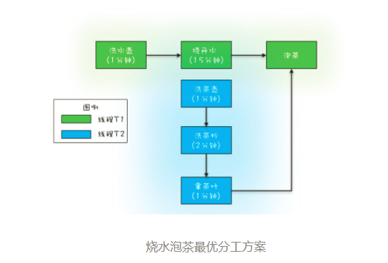

```
// 创建任务T2的FutureTask
FutureTask<String> ft2
  = new FutureTask<>(new T2Task());
// 创建任务T1的FutureTask
FutureTask<String> ft1
  = new FutureTask<>(new T1Task(ft2));
// 线程T1执行任务ft1
Thread T1 = new Thread(ft1);
T1.start();
// 线程T2执行任务ft2
Thread T2 = new Thread(ft2);
T2.start();
// 等待线程T1执行结果
System.out.println(ft1.get());

// T1Task需要执行的任务：
// 洗水壶、烧开水、泡茶
class T1Task implements Callable<String>{
  FutureTask<String> ft2;
  // T1任务需要T2任务的FutureTask
  T1Task(FutureTask<String> ft2){
    this.ft2 = ft2;
  }
  @Override
  String call() throws Exception {
    System.out.println("T1:洗水壶...");
    TimeUnit.SECONDS.sleep(1);
    
    System.out.println("T1:烧开水...");
    TimeUnit.SECONDS.sleep(15);
    // 获取T2线程的茶叶  
    String tf = ft2.get();
    System.out.println("T1:拿到茶叶:"+tf);

    System.out.println("T1:泡茶...");
    return "上茶:" + tf;
  }
}
// T2Task需要执行的任务:
// 洗茶壶、洗茶杯、拿茶叶
class T2Task implements Callable<String> {
  @Override
  String call() throws Exception {
    System.out.println("T2:洗茶壶...");
    TimeUnit.SECONDS.sleep(1);

    System.out.println("T2:洗茶杯...");
    TimeUnit.SECONDS.sleep(2);

    System.out.println("T2:拿茶叶...");
    TimeUnit.SECONDS.sleep(1);
    return "龙井";
  }
}
// 一次执行结果：
T1:洗水壶...
T2:洗茶壶...
T1:烧开水...
T2:洗茶杯...
T2:拿茶叶...
T1:拿到茶叶:龙井
T1:泡茶...
上茶:龙井
```

### CompletableFuture

```
//任务1：洗水壶->烧开水
CompletableFuture<Void> f1 = 
  CompletableFuture.runAsync(()->{
  System.out.println("T1:洗水壶...");
  sleep(1, TimeUnit.SECONDS);

  System.out.println("T1:烧开水...");
  sleep(15, TimeUnit.SECONDS);
});
//任务2：洗茶壶->洗茶杯->拿茶叶
CompletableFuture<String> f2 = 
  CompletableFuture.supplyAsync(()->{
  System.out.println("T2:洗茶壶...");
  sleep(1, TimeUnit.SECONDS);

  System.out.println("T2:洗茶杯...");
  sleep(2, TimeUnit.SECONDS);

  System.out.println("T2:拿茶叶...");
  sleep(1, TimeUnit.SECONDS);
  return "龙井";
});
//任务3：任务1和任务2完成后执行：泡茶
CompletableFuture<String> f3 = 
  f1.thenCombine(f2, (__, tf)->{
    System.out.println("T1:拿到茶叶:" + tf);
    System.out.println("T1:泡茶...");
    return "上茶:" + tf;
  });
//等待任务3执行结果
System.out.println(f3.join());

void sleep(int t, TimeUnit u) {
  try {
    u.sleep(t);
  }catch(InterruptedException e){}
}
// 一次执行结果：
T1:洗水壶...
T2:洗茶壶...
T1:烧开水...
T2:洗茶杯...
T2:拿茶叶...
T1:拿到茶叶:龙井
T1:泡茶...
上茶:龙井
```

```
//使用默认线程池
static CompletableFuture<Void> 
  runAsync(Runnable runnable)
static <U> CompletableFuture<U> 
  supplyAsync(Supplier<U> supplier)
//可以指定线程池  
static CompletableFuture<Void> 
  runAsync(Runnable runnable, Executor executor)
static <U> CompletableFuture<U> 
  supplyAsync(Supplier<U> supplier, Executor executor)  
```

> 根据不同的业务类型创建不同的线程池，以避免互相干扰。默认使用的是公共的java.util.concurrent.ForkJoinPool。

#### CompletionStage接口

##### 串行

```
CompletableFuture<String> f0 = 
  CompletableFuture.supplyAsync(
    () -> "Hello World")      //①
  .thenApply(s -> s + " QQ")  //②
  .thenApply(String::toUpperCase);//③

System.out.println(f0.join());
//输出结果
HELLO WORLD QQ
```

##### AND聚合

```
CompletionStage<R> thenCombine(other, fn);
CompletionStage<R> thenCombineAsync(other, fn);
CompletionStage<Void> thenAcceptBoth(other, consumer);
CompletionStage<Void> thenAcceptBothAsync(other, consumer);
CompletionStage<Void> runAfterBoth(other, action);
CompletionStage<Void> runAfterBothAsync(other, action);
```

##### OR聚合

```
CompletionStage applyToEither(other, fn);
CompletionStage applyToEitherAsync(other, fn);
CompletionStage acceptEither(other, consumer);
CompletionStage acceptEitherAsync(other, consumer);
CompletionStage runAfterEither(other, action);
CompletionStage runAfterEitherAsync(other, action);
```

```
CompletableFuture<String> f1 = 
  CompletableFuture.supplyAsync(()->{
    int t = getRandom(5, 10);
    sleep(t, TimeUnit.SECONDS);
    return String.valueOf(t);
});

CompletableFuture<String> f2 = 
  CompletableFuture.supplyAsync(()->{
    int t = getRandom(5, 10);
    sleep(t, TimeUnit.SECONDS);
    return String.valueOf(t);
});

CompletableFuture<String> f3 = 
  f1.applyToEither(f2,s -> s);

System.out.println(f3.join());
```

##### 异常处理

```
CompletionStage exceptionally(fn);
CompletionStage<R> whenComplete(consumer);
CompletionStage<R> whenCompleteAsync(consumer);
CompletionStage<R> handle(fn);
CompletionStage<R> handleAsync(fn);
```

```
CompletableFuture<Integer> 
  f0 = CompletableFuture
    .supplyAsync(()->7/0))
    .thenApply(r->r*10)
    .exceptionally(e->0);
System.out.println(f0.join());
```

### CompletionService

批量执行异步任务。

```
ExecutorCompletionService(Executor executor)；
ExecutorCompletionService(Executor executor, BlockingQueue<Future<V>> completionQueue)。
```

> 任务执行结果的Future对象就是加入到completionQueue中。

```
// 创建线程池
ExecutorService executor = 
  Executors.newFixedThreadPool(3);
// 创建CompletionService
CompletionService<Integer> cs = new 
  ExecutorCompletionService<>(executor);
// 异步向电商S1询价
cs.submit(()->getPriceByS1());
// 异步向电商S2询价
cs.submit(()->getPriceByS2());
// 异步向电商S3询价
cs.submit(()->getPriceByS3());
// 将询价结果异步保存到数据库
for (int i=0; i<3; i++) {
  Integer r = cs.take().get();
  executor.execute(()->save(r));
}
```

### 分治任务模型

+ 任务分解:将任务迭代地分解为子任务，直至子任务可以直接计算出结果；
+ 结果合并:逐层合并子任务的执行结果，直至获得最终结果。

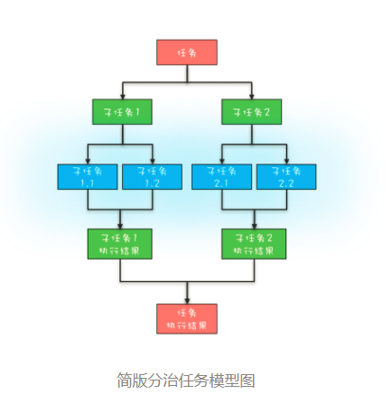

#### 案例一`斐波那契数列`

```
static void main(String[] args){
  //创建分治任务线程池  
  ForkJoinPool fjp = 
    new ForkJoinPool(4);
  //创建分治任务
  Fibonacci fib = 
    new Fibonacci(30);   
  //启动分治任务  
  Integer result = 
    fjp.invoke(fib);
  //输出结果  
  System.out.println(result);
}
//递归任务
static class Fibonacci extends 
    RecursiveTask<Integer>{
  final int n;
  Fibonacci(int n){this.n = n;}
  protected Integer compute(){
    if (n <= 1)
      return n;
    Fibonacci f1 = 
      new Fibonacci(n - 1);
    //创建子任务  
    f1.fork();
    Fibonacci f2 = 
      new Fibonacci(n - 2);
    //等待子任务结果，并合并结果  
    return f2.compute() + f1.join();
  }
}
```

#### 案例二`统计单词数量`

```
static void main(String[] args){
  String[] fc = {"hello world",
          "hello me",
          "hello fork",
          "hello join",
          "fork join in world"};
  //创建ForkJoin线程池    
  ForkJoinPool fjp = 
      new ForkJoinPool(3);
  //创建任务    
  MR mr = new MR(
      fc, 0, fc.length);  
  //启动任务    
  Map<String, Long> result = 
      fjp.invoke(mr);
  //输出结果    
  result.forEach((k, v)->
    System.out.println(k+":"+v));
}
//MR模拟类
static class MR extends 
  RecursiveTask<Map<String, Long>> {
  private String[] fc;
  private int start, end;
  //构造函数
  MR(String[] fc, int fr, int to){
    this.fc = fc;
    this.start = fr;
    this.end = to;
  }
  @Override protected 
  Map<String, Long> compute(){
    if (end - start == 1) {
      return calc(fc[start]);
    } else {
      int mid = (start+end)/2;
      MR mr1 = new MR(
          fc, start, mid);
      mr1.fork();
      MR mr2 = new MR(
          fc, mid, end);
      //计算子任务，并返回合并的结果    
      return merge(mr2.compute(),
          mr1.join());
    }
  }
  //合并结果
  private Map<String, Long> merge(
      Map<String, Long> r1, 
      Map<String, Long> r2) {
    Map<String, Long> result = 
        new HashMap<>();
    result.putAll(r1);
    //合并结果
    r2.forEach((k, v) -> {
      Long c = result.get(k);
      if (c != null)
        result.put(k, c+v);
      else 
        result.put(k, v);
    });
    return result;
  }
  //统计单词数量
  private Map<String, Long> 
      calc(String line) {
    Map<String, Long> result =
        new HashMap<>();
    //分割单词    
    String [] words = 
        line.split("\\s+");
    //统计单词数量    
    for (String w : words) {
      Long v = result.get(w);
      if (v != null) 
        result.put(w, v+1);
      else
        result.put(w, 1L);
    }
    return result;
  }
}
```

### 并发设计模式

#### Immutability模式

（1）快速实现具备不可变性的类

类和属性都是`final`的，所有方法均是只读的。例如String、Integer类。

（2）对于不可变的类如何提高修改的方法？

解决方法是创建一个新的不可变对象。

##### 应用场景

+ 被建模对象的状态变化不频繁
+ 同时对一组相关的数据进行写操作，因此需要保证原子性
+ 使用某个对象作为安全的HashMap的key，比如String、Integer等

#### Copy-on-Write模式

缺点：消耗内存，每次修改都需要复制一个新的对象出来。

场景：适用于读多写少，数据弱一致性。

```
//路由信息
public final class Router{
  private final String  ip;
  private final Integer port;
  private final String  iface;
  //构造函数
  public Router(String ip, 
      Integer port, String iface){
    this.ip = ip;
    this.port = port;
    this.iface = iface;
  }
  //重写equals方法
  public boolean equals(Object obj){
    if (obj instanceof Router) {
      Router r = (Router)obj;
      return iface.equals(r.iface) &&
             ip.equals(r.ip) &&
             port.equals(r.port);
    }
    return false;
  }
  public int hashCode() {
    //省略hashCode相关代码
  }
}
//路由表信息
public class RouterTable {
  //Key:接口名
  //Value:路由集合
  ConcurrentHashMap<String, CopyOnWriteArraySet<Router>> 
    rt = new ConcurrentHashMap<>();
  //根据接口名获取路由表
  public Set<Router> get(String iface){
    return rt.get(iface);
  }
  //删除路由
  public void remove(Router router) {
    Set<Router> set=rt.get(router.iface);
    if (set != null) {
      set.remove(router);
    }
  }
  //增加路由
  public void add(Router router) {
    Set<Router> set = rt.computeIfAbsent(
      route.iface, r -> 
        new CopyOnWriteArraySet<>());
    set.add(router);
  }
}
```

#### 线程本地存储模式

本质上是一种避免共享的方案。

```
class Thread {
  //内部持有ThreadLocalMap
  ThreadLocal.ThreadLocalMap 
    threadLocals;
}
class ThreadLocal<T>{
  public T get() {
    //首先获取线程持有的
    //ThreadLocalMap
    ThreadLocalMap map =
      Thread.currentThread()
        .threadLocals;
    //在ThreadLocalMap中
    //查找变量
    Entry e = 
      map.getEntry(this);
    return e.value;  
  }
  static class ThreadLocalMap{
    //内部是数组而不是Map
    Entry[] table;
    //根据ThreadLocal查找Entry
    Entry getEntry(ThreadLocal key){
      //省略查找逻辑
    }
    //Entry定义
    static class Entry extends
    WeakReference<ThreadLocal>{
      Object value;
    }
  }
}
```

##### 应用场景

+ 需要使用非线程安全对象，但又不希望引入锁。
+ 使用线程安全对象，但希望避免其使用的锁的开销和相关问题。
+ 特定于线程的单例模式。

#### Guarded Suspension模式

可用于异步转同步。

```
class GuardedObject<T>{
  //受保护的对象
  T obj;
  final Lock lock = 
    new ReentrantLock();
  final Condition done =
    lock.newCondition();
  final int timeout=1;
  //获取受保护对象  
  T get(Predicate<T> p) {
    lock.lock();
    try {
      //MESA管程推荐写法
      while(!p.test(obj)){
        done.await(timeout, 
          TimeUnit.SECONDS);
      }
    }catch(InterruptedException e){
      throw new RuntimeException(e);
    }finally{
      lock.unlock();
    }
    //返回非空的受保护对象
    return obj;
  }
  //事件通知方法
  void onChanged(T obj) {
    lock.lock();
    try {
      this.obj = obj;
      done.signalAll();
    } finally {
      lock.unlock();
    }
  }
}
```

```
class GuardedObject<T>{
  //受保护的对象
  T obj;
  final Lock lock = 
    new ReentrantLock();
  final Condition done =
    lock.newCondition();
  final int timeout=2;
  //保存所有GuardedObject
  final static Map<Object, GuardedObject> 
  gos=new ConcurrentHashMap<>();
  //静态方法创建GuardedObject
  static <K> GuardedObject 
      create(K key){
    GuardedObject go=new GuardedObject();
    gos.put(key, go);
    return go;
  }
  static <K, T> void 
      fireEvent(K key, T obj){
    GuardedObject go=gos.remove(key);
    if (go != null){
      go.onChanged(obj);
    }
  }
  //获取受保护对象  
  T get(Predicate<T> p) {
    lock.lock();
    try {
      //MESA管程推荐写法
      while(!p.test(obj)){
        done.await(timeout, 
          TimeUnit.SECONDS);
      }
    }catch(InterruptedException e){
      throw new RuntimeException(e);
    }finally{
      lock.unlock();
    }
    //返回非空的受保护对象
    return obj;
  }
  //事件通知方法
  void onChanged(T obj) {
    lock.lock();
    try {
      this.obj = obj;
      done.signalAll();
    } finally {
      lock.unlock();
    }
  }
}
```

##### 可复用代码

```
public interface Predicate {
    boolean evaluate();
}
```

```
public abstract class GuardedAction<V> implements Callable<V> {
    protected final Predicate guard;

    public GuardedAction(Predicate guard) {
        this.guard = guard;
    }
}
```

```
public interface Blocker {

    /**
     * 在保护条件成立时执行目标动作，否则阻塞当前线程，直到保护条件成立。
     * 
     * @param guardedAction
     *            带保护条件的目标动作
     * @return
     * @throws Exception
     */
    <V> V callWithGuard(GuardedAction<V> guardedAction) throws Exception;

    /**
     * 执行stateOperation所指定的操作后，决定是否唤醒本Blocker所暂挂的所有线程中的一个线程。
     * 
     * @param stateOperation
     *            更改状态的操作，其call方法的返回值为true时，该方法才会唤醒被暂挂的线程
     */
    void signalAfter(Callable<Boolean> stateOperation) throws Exception;

    void signal() throws InterruptedException;

    /**
     * 执行stateOperation所指定的操作后，决定是否唤醒本Blocker所暂挂的所有线程。
     * 
     * @param stateOperation
     *            更改状态的操作，其call方法的返回值为true时，该方法才会唤醒被暂挂的线程
     */
    void broadcastAfter(Callable<Boolean> stateOperation) throws Exception;
}
```

```
public class ConditionVarBlocker implements Blocker {
    private final Lock lock;
    private final Condition condition;
    private final boolean allowAccess2Lock;

    public ConditionVarBlocker(Lock lock) {
        this(lock, true);
    }

    private ConditionVarBlocker(Lock lock, boolean allowAccess2Lock) {
        this.lock = lock;
        this.allowAccess2Lock = allowAccess2Lock;
        this.condition = lock.newCondition();
    }

    public ConditionVarBlocker() {
        this(false);
    }

    public ConditionVarBlocker(boolean allowAccess2Lock) {
        this(new ReentrantLock(), allowAccess2Lock);
    }

    public Lock getLock() {
        if (allowAccess2Lock) {
            return this.lock;
        }
        throw new IllegalStateException("Access to the lock disallowed.");
    }

    public <V> V callWithGuard(GuardedAction<V> guardedAction)
            throws Exception {
        lock.lockInterruptibly();
        V result;
        try {
            final Predicate guard = guardedAction.guard;
            while (!guard.evaluate()) {
                Debug.info("waiting...");
                condition.await();
            }
            result = guardedAction.call();
            return result;
        } finally {
            lock.unlock();
        }
    }

    public void signalAfter(Callable<Boolean> stateOperation) throws Exception {
        lock.lockInterruptibly();
        try {
            if (stateOperation.call()) {
                condition.signal();
            }
        } finally {
            lock.unlock();
        }

    }

    public void broadcastAfter(Callable<Boolean> stateOperation)
            throws Exception {
        lock.lockInterruptibly();
        try {
            if (stateOperation.call()) {
                condition.signalAll();
            }
        } finally {
            lock.unlock();
        }

    }

    public void signal() throws InterruptedException {
        lock.lockInterruptibly();
        try {
            condition.signal();

        } finally {
            lock.unlock();
        }

    }
}
```

##### 使用示例

应用开发人员只需要根据应用的需要实现GuardedObject、ConcretePredicate、ConcreteGuardedAction即可。

```
/**
 * 负责连接告警服务器，并发送告警信息至告警服务器
 *
 */
public class AlarmAgent {
    // 用于记录AlarmAgent是否连接上告警服务器
    private volatile boolean connectedToServer = false;

    // 模式角色：GuardedSuspension.Predicate
    private final Predicate agentConnected = new Predicate() {
        @Override
        public boolean evaluate() {
            return connectedToServer;
        }
    };

    // 模式角色：GuardedSuspension.Blocker
    private final Blocker blocker = new ConditionVarBlocker();

    // 心跳定时器
    private final Timer heartbeatTimer = new Timer(true);

    // 省略其他代码

    /**
     * 发送告警信息
     * 
     * @param alarm
     *            告警信息
     * @throws Exception
     */
    public void sendAlarm(final AlarmInfo alarm) throws Exception {
        /*
         * 可能需要等待，直到AlarmAgent连接上告警服务器（或者连接中断后重新连连上服务器）。<br/>
         * AlarmInfo类的源码参见本书配套下载。
         */
        // 模式角色：GuardedSuspension.GuardedAction
        GuardedAction<Void> guardedAction =
                new GuardedAction<Void>(agentConnected) {
                    public Void call() throws Exception {
                        doSendAlarm(alarm);
                        return null;
                    }
                };

        blocker.callWithGuard(guardedAction);
    }

    // 通过网络连接将告警信息发送给告警服务器
    private void doSendAlarm(AlarmInfo alarm) {
        // 省略其他代码
        Debug.info("sending alarm " + alarm);

        // 模拟发送告警至服务器的耗时
        try {
            Thread.sleep(50);
        } catch (Exception e) {

        }
    }

    public void init() {
        // 省略其他代码

        // 告警连接线程
        Thread connectingThread = new Thread(new ConnectingTask());

        connectingThread.start();

        heartbeatTimer.schedule(new HeartbeatTask(), 60_000, 2000);
    }

    public void disconnect() {
        // 省略其他代码
        Debug.info("disconnected from alarm server.");
        connectedToServer = false;
    }

    protected void onConnected() {
        try {
            blocker.signalAfter(new Callable<Boolean>() {
                @Override
                public Boolean call() {
                    connectedToServer = true;
                    Debug.info("connected to server");
                    return Boolean.TRUE;
                }
            });
        } catch (Exception e) {
            e.printStackTrace();
        }
    }

    protected void onDisconnected() {
        connectedToServer = false;
    }

    // 负责与告警服务器建立网络连接
    private class ConnectingTask implements Runnable {
        @Override
        public void run() {
            // 省略其他代码

            // 模拟连接操作耗时
            Tools.randomPause(100, 40);

            onConnected();
        }
    }

    /**
     * 心跳定时任务：定时检查与告警服务器的连接是否正常，发现连接异常后自动重新连接
     */
    private class HeartbeatTask extends TimerTask {
        // 省略其他代码

        @Override
        public void run() {
            // 省略其他代码

            if (!testConnection()) {
                onDisconnected();
                reconnect();
            }

        }

        private boolean testConnection() {
            // 省略其他代码

            return true;
        }

        private void reconnect() {
            ConnectingTask connectingThread = new ConnectingTask();

            // 直接在心跳定时器线程中执行
            connectingThread.run();
        }

    }
}
```

#### Balking模式

##### synchronized实现

```
boolean changed=false;
//自动存盘操作
void autoSave(){
  synchronized(this){
    if (!changed) {
      return;
    }
    changed = false;
  }
  //执行存盘操作
  //省略且实现
  this.execSave();
}
//编辑操作
void edit(){
  //省略编辑逻辑
  ......
  change();
}
//改变状态
void change(){
  synchronized(this){
    changed = true;
  }
}
```

##### volatile实现

不具备原子性。

```
//路由表信息
public class RouterTable {
  //Key:接口名
  //Value:路由集合
  ConcurrentHashMap<String, CopyOnWriteArraySet<Router>> 
    rt = new ConcurrentHashMap<>();    
  //路由表是否发生变化
  volatile boolean changed;
  //将路由表写入本地文件的线程池
  ScheduledExecutorService ses=
    Executors.newSingleThreadScheduledExecutor();
  //启动定时任务
  //将变更后的路由表写入本地文件
  public void startLocalSaver(){
    ses.scheduleWithFixedDelay(()->{
      autoSave();
    }, 1, 1, MINUTES);
  }
  //保存路由表到本地文件
  void autoSave() {
    if (!changed) {
      return;
    }
    changed = false;
    //将路由表写入本地文件
    //省略其方法实现
    this.save2Local();
  }
  //删除路由
  public void remove(Router router) {
    Set<Router> set=rt.get(router.iface);
    if (set != null) {
      set.remove(router);
      //路由表已发生变化
      changed = true;
    }
  }
  //增加路由
  public void add(Router router) {
    Set<Router> set = rt.computeIfAbsent(
      route.iface, r -> 
        new CopyOnWriteArraySet<>());
    set.add(router);
    //路由表已发生变化
    changed = true;
  }
}
```

##### 单次初始化

```
class InitTest{
  boolean inited = false;
  synchronized void init(){
    if(inited){
      return;
    }
    //省略doInit的实现
    doInit();
    inited=true;
  }
}
```

##### 单例模式实现

```
class Singleton{
  private static volatile 
    Singleton singleton;
  //构造方法私有化  
  private Singleton() {}
  //获取实例（单例）
  public static Singleton 
  getInstance() {
    //第一次检查
    if(singleton==null){
      synchronize{Singleton.class){
        //获取锁后二次检查
        if(singleton==null){
          singleton=new Singleton();
        }
      }
    }
    return singleton;
  }
}
```

#### Serial-Thread-Confinement模式

将多个并发的任务存入队列实现任务的串行化，并为这些串行化的任务创建唯一的一个工作者线程进行处理。本质是使用一个开销更小的锁（队列涉及的锁）去替代另一个可能的开销更大的锁。

##### 可复用代码

```
/**
 * 对任务处理的抽象。
 *
 * @param <T>
 *            表示任务的类型
 * @param <V>
 *            表示任务处理结果的类型
 */
public interface TaskProcessor<T, V> {
    /**
     * 对指定任务进行处理。
     * 
     * @param task
     *            任务
     * @return 任务处理结果
     * @throws Exception
     */
    V doProcess(T task) throws Exception;
}
```

```
/**
 * 可停止的抽象线程。
 * 
 * 模式角色：Two-phaseTermination.AbstractTerminatableThread
 */
public abstract class AbstractTerminatableThread extends Thread
        implements Terminatable {
    final static Logger logger =
            Logger.getLogger(AbstractTerminatableThread.class);
    private final boolean DEBUG = true;

    // 模式角色：Two-phaseTermination.TerminationToken
    public final TerminationToken terminationToken;

    public AbstractTerminatableThread() {
        this(new TerminationToken());
    }

    /**
     * 
     * @param terminationToken
     *            线程间共享的线程终止标志实例
     */
    public AbstractTerminatableThread(TerminationToken terminationToken) {
        this.terminationToken = terminationToken;
        terminationToken.register(this);
    }

    /**
     * 留给子类实现其线程处理逻辑。
     * 
     * @throws Exception
     */
    protected abstract void doRun() throws Exception;

    /**
     * 留给子类实现。用于实现线程停止后的一些清理动作。
     * 
     * @param cause
     */
    protected void doCleanup(Exception cause) {
        // 什么也不做
    }

    /**
     * 留给子类实现。用于执行线程停止所需的操作。
     */
    protected void doTerminiate() {
        // 什么也不做
    }

    @Override
    public void run() {
        Exception ex = null;
        try {
            for (;;) {

                // 在执行线程的处理逻辑前先判断线程停止的标志。
                if (terminationToken.isToShutdown()
                        && terminationToken.reservations.get() <= 0) {
                    break;
                }
                doRun();
            }

        } catch (Exception e) {
            // 使得线程能够响应interrupt调用而退出
            ex = e;
            if (e instanceof InterruptedException) {
                if (DEBUG) {
                    logger.debug(e);
                }
            } else {
                logger.error("", e);
            }
        } finally {
            try {
                doCleanup(ex);
            } finally {
                terminationToken.notifyThreadTermination(this);
            }
        }
    }

    @Override
    public void interrupt() {
        terminate();
    }

    /*
     * 请求停止线程。
     * 
     * @see io.github.viscent.mtpattern.tpt.Terminatable#terminate()
     */
    @Override
    public void terminate() {
        terminationToken.setToShutdown(true);
        try {
            doTerminiate();
        } finally {

            // 若无待处理的任务，则试图强制终止线程
            if (terminationToken.reservations.get() <= 0) {
                super.interrupt();
            }
        }
    }

    public void terminate(boolean waitUtilThreadTerminated) {
        terminate();
        if (waitUtilThreadTerminated) {
            try {
                this.join();
            } catch (InterruptedException e) {
                Thread.currentThread().interrupt();
            }
        }
    }

}
```

```
public class TerminatableWorkerThread<T, V> extends AbstractTerminatableThread {
    private final BlockingQueue<Runnable> workQueue;

    // 负责真正执行任务的对象
    private final TaskProcessor<T, V> taskProcessor;

    public TerminatableWorkerThread(BlockingQueue<Runnable> workQueue,
            TaskProcessor<T, V> taskProcessor) {
        this.workQueue = workQueue;
        this.taskProcessor = taskProcessor;
    }

    /**
     * 接收并行任务，并将其串行化。
     * 
     * @param task
     *            任务
     * @return 可借以获取任务处理结果的Promise（参见第6章，Promise模式）实例。
     * @throws InterruptedException
     */
    public Future<V> submit(final T task) throws InterruptedException {
        Callable<V> callable = new Callable<V>() {

            @Override
            public V call() throws Exception {
                return taskProcessor.doProcess(task);
            }

        };

        FutureTask<V> ft = new FutureTask<V>(callable);
        workQueue.put(ft);

        terminationToken.reservations.incrementAndGet();
        return ft;
    }

    /**
     * 执行任务的处理逻辑
     */
    @Override
    protected void doRun() throws Exception {
        Runnable ft = workQueue.take();
        try {
            ft.run();
        } finally {
            terminationToken.reservations.decrementAndGet();
        }

    }

}
```

```
public abstract class AbstractSerializer<T, V> {
    private final TerminatableWorkerThread<T, V> workerThread;

    public AbstractSerializer(BlockingQueue<Runnable> workQueue,
            TaskProcessor<T, V> taskProcessor) {
        workerThread = new TerminatableWorkerThread<T, V>(workQueue,
                taskProcessor);
    }

    /**
     * 留给子类实现。用于根据指定参数生成相应的任务实例。
     * 
     * @param params
     *            参数列表
     * @return 任务实例。用于提交给WorkerThread。
     */
    protected abstract T makeTask(Object... params);

    /**
     * 该类对外暴露的服务方法。 该类的子需要定义一个命名含义比该方法更为具体的方法（如downloadFile）。
     * 含义具体的服务方法（如downloadFile）可直接调用该方法。
     * 
     * @param params
     *            客户端代码调用该方法时所传递的参数列表
     * @return 可借以获取任务处理结果的Promise（参见第6章，Promise模式）实例。
     * @throws InterruptedException
     */
    protected Future<V> service(Object... params) throws InterruptedException {
        T task = makeTask(params);
        Future<V> resultPromise = workerThread.submit(task);

        return resultPromise;
    }

    /**
     * 初始化该类对外暴露的服务。
     */
    public void init() {
        workerThread.start();
    }

    /**
     * 停止该类对外暴露的服务。
     */
    public void shutdown() {
        workerThread.terminate();
    }

}
```

##### 使用示例

+ 定义Serializer提交给WorkerThread的任务对应的类型。
+ 定义AbstractSerializer的子类，定义一个名字含义比service更具体的方法，该方法可直接调用父类的service()。
+ 定义TaskProcessor接口的实现类。

```
public class ReusableCodeExample {

    public static void main(String[] args)
            throws InterruptedException, ExecutionException {
        SomeService ss = new SomeService();
        ss.init();
        Future<String> result = ss.doSomething("Serial Thread Confinement", 1);
        // 模拟执行其他操作
        Tools.randomPause(100, 50);

        Debug.info(result.get());

        ss.shutdown();

    }

    private static class Task {
        public final String message;
        public final int id;

        public Task(String message, int id) {
            this.message = message;
            this.id = id;
        }
    }

    static class SomeService extends AbstractSerializer<Task, String> {

        public SomeService() {
            super(
                    new ArrayBlockingQueue<Runnable>(100),
                    new TaskProcessor<Task, String>() {

                        @Override
                        public String doProcess(Task task) throws Exception {
                            Debug.info("[" + task.id + "]:" + task.message);
                            return task.message + " accepted.";
                        }

                    });
        }

        @Override
        protected Task makeTask(Object... params) {
            String message = (String) params[0];
            int id = (Integer) params[1];

            return new Task(message, id);
        }

        public Future<String> doSomething(String message, int id)
                throws InterruptedException {
            Future<String> result = null;
            result = service(message, id);
            return result;
        }

    }

}
```

#### Thread-Per-Message模式

解决宏观的分工问题。为每个任务分配一个独立的线程。

应用场景：网络编程里服务端的实现。

```
final ServerSocketChannel ssc = 
  ServerSocketChannel.open().bind(
    new InetSocketAddress(8080));
//处理请求    
try {
  while (true) {
    // 接收请求
    SocketChannel sc = ssc.accept();
    // 每个请求都创建一个线程
    new Thread(()->{
      try {
        // 读Socket
        ByteBuffer rb = ByteBuffer
          .allocateDirect(1024);
        sc.read(rb);
        //模拟处理请求
        Thread.sleep(2000);
        // 写Socket
        ByteBuffer wb = 
          (ByteBuffer)rb.flip();
        sc.write(wb);
        // 关闭Socket
        sc.close();
      }catch(Exception e){
        throw new UncheckedIOException(e);
      }
    }).start();
  }
} finally {
  ssc.close();
}   
```

#### Worker Thread模式

```
ExecutorService es = Executors
  .newFixedThreadPool(500);
final ServerSocketChannel ssc = 
  ServerSocketChannel.open().bind(
    new InetSocketAddress(8080));
//处理请求    
try {
  while (true) {
    // 接收请求
    SocketChannel sc = ssc.accept();
    // 将请求处理任务提交给线程池
    es.execute(()->{
      try {
        // 读Socket
        ByteBuffer rb = ByteBuffer
          .allocateDirect(1024);
        sc.read(rb);
        //模拟处理请求
        Thread.sleep(2000);
        // 写Socket
        ByteBuffer wb = 
          (ByteBuffer)rb.flip();
        sc.write(wb);
        // 关闭Socket
        sc.close();
      }catch(Exception e){
        throw new UncheckedIOException(e);
      }
    });
  }
} finally {
  ssc.close();
  es.shutdown();
}   
```

```
ExecutorService es = new ThreadPoolExecutor(
  50, 500,
  60L, TimeUnit.SECONDS,
  //注意要创建有界队列
  new LinkedBlockingQueue<Runnable>(2000),
  //建议根据业务需求实现ThreadFactory
  r->{
    return new Thread(r, "echo-"+ r.hashCode());
  },
  //建议根据业务需求实现RejectedExecutionHandler
  new ThreadPoolExecutor.CallerRunsPolicy());
```

> 注：提交到相同线程池中的任务一定是相互独立的。

#### 两阶段终止模式

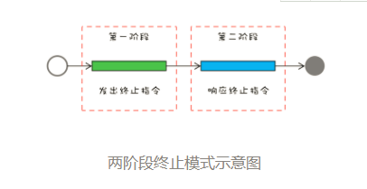

将终止过程分成两个阶段，其中第一个阶段主要是线程T1向线程T2发送终止指令，而第二阶段则是线程T2响应终止指令。

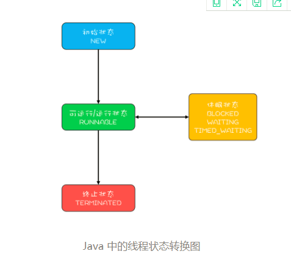

Java线程进入终止状态的前提是线程进入RUNNABLE状态。Java Thread类提供的interrupt()方法，它可以将休眠状态的线程转换到RUNNABLE状态。

优雅的方式是让Java线程自己执行完run()方法，所以一般我们采用的方法是设置一个标志位，然后线程会在合适的时机检查这个标志位，如果发现符合终止条件，则自动退出run()方法。

```
class Proxy {
  boolean started = false;
  //采集线程
  Thread rptThread;
  //启动采集功能
  synchronized void start(){
    //不允许同时启动多个采集线程
    if (started) {
      return;
    }
    started = true;
    rptThread = new Thread(()->{
      while (!Thread.currentThread().isInterrupted()){
        //省略采集、回传实现
        report();
        //每隔两秒钟采集、回传一次数据
        try {
          Thread.sleep(2000);
        } catch (InterruptedException e){
          //重新设置线程中断状态
          Thread.currentThread().interrupt();
        }
      }
      //执行到此处说明线程马上终止
      started = false;
    });
    rptThread.start();
  }
  //终止采集功能
  synchronized void stop(){
    rptThread.interrupt();
  }
}
```

设置自己的线程终止标志位，避免第三方库没有正确的处理中断。

```
class Proxy {
  //线程终止标志位
  volatile boolean terminated = false;
  boolean started = false;
  //采集线程
  Thread rptThread;
  //启动采集功能
  synchronized void start(){
    //不允许同时启动多个采集线程
    if (started) {
      return;
    }
    started = true;
    terminated = false;
    rptThread = new Thread(()->{
      while (!terminated){
        //省略采集、回传实现
        report();
        //每隔两秒钟采集、回传一次数据
        try {
          Thread.sleep(2000);
        } catch (InterruptedException e){
          //重新设置线程中断状态
          Thread.currentThread().interrupt();
        }
      }
      //执行到此处说明线程马上终止
      started = false;
    });
    rptThread.start();
  }
  //终止采集功能
  synchronized void stop(){
    //设置中断标志位
    terminated = true;
    //中断线程rptThread
    rptThread.interrupt();
  }
}
```

##### 线程池的终止

+ shutdown()：拒绝接收新的任务，但是会等待线程池中正在执行的任务和已经进入阻塞队列的任务都执行完之后才最终关闭线程池。
+ shutdownNow()：会拒绝接收新的任务，同时还会中断线程池中正在执行的任务，已经进入阻塞队列的任务也被剥夺了执行的机会，不过这些被剥夺执行机会的任务会作为 shutdownNow() 方法的返回值返回。

##### 毒丸

“毒丸”对象是生产者生产的一条特殊任务，然后当消费者线程读到“毒丸”对象时，会立即终止自身的执行。

```
class Logger {
  //用于终止日志执行的“毒丸”
  final LogMsg poisonPill = 
    new LogMsg(LEVEL.ERROR, "");
  //任务队列  
  final BlockingQueue<LogMsg> bq
    = new BlockingQueue<>();
  //只需要一个线程写日志
  ExecutorService es = 
    Executors.newFixedThreadPool(1);
  //启动写日志线程
  void start(){
    File file=File.createTempFile(
      "foo", ".log");
    final FileWriter writer=
      new FileWriter(file);
    this.es.execute(()->{
      try {
        while (true) {
          LogMsg log = bq.poll(
            5, TimeUnit.SECONDS);
          //如果是“毒丸”，终止执行  
          if(poisonPill.equals(logMsg)){
            break;
          }  
          //省略执行逻辑
        }
      } catch(Exception e){
      } finally {
        try {
          writer.flush();
          writer.close();
        }catch(IOException e){}
      }
    });  
  }
  //终止写日志线程
  public void stop() {
    //将“毒丸”对象加入阻塞队列
    bq.add(poisonPill);
    es.shutdown();
  }
}
```

##### 可复用代码

```
public interface Terminatable {
    void terminate();
}
```

```
/**
 * 线程停止标志。
 *
 */
public class TerminationToken {

    // 使用volatile修饰，以保证无需显式锁的情况下该变量的内存可见性
    protected volatile boolean toShutdown = false;
    public final AtomicInteger reservations = new AtomicInteger(0);

    /*
     * 在多个可停止线程实例共享一个TerminationToken实例的情况下，该队列用于
     * 记录那些共享TerminationToken实例的可停止线程，以便尽可能减少锁的使用 的情况下，实现这些线程的停止。
     */
    private final Queue<WeakReference<Terminatable>> coordinatedThreads;

    public TerminationToken() {
        coordinatedThreads = new ConcurrentLinkedQueue<WeakReference<Terminatable>>();
    }

    public boolean isToShutdown() {
        return toShutdown;
    }

    protected void setToShutdown(boolean toShutdown) {
        this.toShutdown = true;
    }

    protected void register(Terminatable thread) {
        coordinatedThreads.add(new WeakReference<Terminatable>(thread));
    }

    /**
     * 通知TerminationToken实例：共享该实例的所有可停止线程中的一个线程停止了， 以便其停止其它未被停止的线程。
     * 
     * @param thread
     *            已停止的线程
     */
    protected void notifyThreadTermination(Terminatable thread) {
        WeakReference<Terminatable> wrThread;
        Terminatable otherThread;
        while (null != (wrThread = coordinatedThreads.poll())) {
            otherThread = wrThread.get();
            if (null != otherThread && otherThread != thread) {
                otherThread.terminate();
            }
        }
    }

}
```

```
/**
 * 可停止的抽象线程。
 * 
 * 模式角色：Two-phaseTermination.AbstractTerminatableThread
 */
public abstract class AbstractTerminatableThread extends Thread
        implements Terminatable {
    final static Logger logger =
            Logger.getLogger(AbstractTerminatableThread.class);
    private final boolean DEBUG = true;

    // 模式角色：Two-phaseTermination.TerminationToken
    public final TerminationToken terminationToken;

    public AbstractTerminatableThread() {
        this(new TerminationToken());
    }

    /**
     * 
     * @param terminationToken
     *            线程间共享的线程终止标志实例
     */
    public AbstractTerminatableThread(TerminationToken terminationToken) {
        this.terminationToken = terminationToken;
        terminationToken.register(this);
    }

    /**
     * 留给子类实现其线程处理逻辑。
     * 
     * @throws Exception
     */
    protected abstract void doRun() throws Exception;

    /**
     * 留给子类实现。用于实现线程停止后的一些清理动作。
     * 
     * @param cause
     */
    protected void doCleanup(Exception cause) {
        // 什么也不做
    }

    /**
     * 留给子类实现。用于执行线程停止所需的操作。
     */
    protected void doTerminiate() {
        // 什么也不做
    }

    @Override
    public void run() {
        Exception ex = null;
        try {
            for (;;) {

                // 在执行线程的处理逻辑前先判断线程停止的标志。
                if (terminationToken.isToShutdown()
                        && terminationToken.reservations.get() <= 0) {
                    break;
                }
                doRun();
            }

        } catch (Exception e) {
            // 使得线程能够响应interrupt调用而退出
            ex = e;
            if (e instanceof InterruptedException) {
                if (DEBUG) {
                    logger.debug(e);
                }
            } else {
                logger.error("", e);
            }
        } finally {
            try {
                doCleanup(ex);
            } finally {
                terminationToken.notifyThreadTermination(this);
            }
        }
    }

    @Override
    public void interrupt() {
        terminate();
    }

    /*
     * 请求停止线程。
     * 
     * @see io.github.viscent.mtpattern.tpt.Terminatable#terminate()
     */
    @Override
    public void terminate() {
        terminationToken.setToShutdown(true);
        try {
            doTerminiate();
        } finally {

            // 若无待处理的任务，则试图强制终止线程
            if (terminationToken.reservations.get() <= 0) {
                super.interrupt();
            }
        }
    }

    public void terminate(boolean waitUtilThreadTerminated) {
        terminate();
        if (waitUtilThreadTerminated) {
            try {
                this.join();
            } catch (InterruptedException e) {
                Thread.currentThread().interrupt();
            }
        }
    }

}
```

##### 使用示例

应用代码只需要在定义`AbstractTerminatableThread`的子类时实现`doRun`方法。

```
public class AlarmSendingThread extends AbstractTerminatableThread {

    private final AlarmAgent alarmAgent = new AlarmAgent();

    /*
     * 告警队列。 模式角色：HalfSync/HalfAsync.Queue
     */
    private final BlockingQueue<AlarmInfo> alarmQueue;
    private final ConcurrentMap<String, AtomicInteger> submittedAlarmRegistry;

    public AlarmSendingThread() {

        alarmQueue = new ArrayBlockingQueue<AlarmInfo>(100);

        submittedAlarmRegistry = new ConcurrentHashMap<String, AtomicInteger>();

        alarmAgent.init();
    }

    @Override
    protected void doRun() throws Exception {
        AlarmInfo alarm;
        alarm = alarmQueue.take();
        terminationToken.reservations.decrementAndGet();

        try {
            // 将告警信息发送至告警服务器
            alarmAgent.sendAlarm(alarm);
        } catch (Exception e) {
            e.printStackTrace();
        }

        /*
         * 处理恢复告警：将相应的故障告警从注册表中删除， 使得相应故障恢复后若再次出现相同故障，该故障信息能够上报到服务器
         */
        if (AlarmType.RESUME == alarm.type) {
            String key =
                    AlarmType.FAULT.toString() + ':' + alarm.getId() + '@'
                            + alarm.getExtraInfo();
            submittedAlarmRegistry.remove(key);

            key =
                    AlarmType.RESUME.toString() + ':' + alarm.getId() + '@'
                            + alarm.getExtraInfo();
            submittedAlarmRegistry.remove(key);
        }

    }

    public int sendAlarm(final AlarmInfo alarmInfo) {
        AlarmType type = alarmInfo.type;
        String id = alarmInfo.getId();
        String extraInfo = alarmInfo.getExtraInfo();

        if (terminationToken.isToShutdown()) {
            // 记录告警信息
            System.err.println("rejected alarm:" + id + "," + extraInfo);
            return -1;
        }

        int duplicateSubmissionCount = 0;
        try {

            AtomicInteger prevSubmittedCounter;

            prevSubmittedCounter =
                    submittedAlarmRegistry.putIfAbsent(type.toString()
                            + ':' + id + '@' + extraInfo, new AtomicInteger(0));
            if (null == prevSubmittedCounter) {
                alarmQueue.put(alarmInfo);
                terminationToken.reservations.incrementAndGet();
            } else {

                // 故障未恢复，不用重复发送告警信息给服务器，故仅增加计数
                duplicateSubmissionCount =
                        prevSubmittedCounter.incrementAndGet();
            }
        } catch (Throwable t) {
            t.printStackTrace();
        }

        return duplicateSubmissionCount;
    }

    @Override
    protected void doCleanup(Exception exp) {
        if (null != exp && !(exp instanceof InterruptedException)) {
            exp.printStackTrace();
        }
        alarmAgent.disconnect();
    }

}
```

#### 生产者-消费者模式

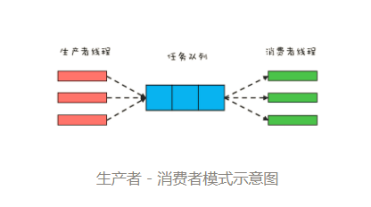

应用场景：线程池。

优点：解耦，支持异步，平衡生产者和消费者的速度差异。

```
//任务队列
BlockingQueue<Task> bq=new
  LinkedBlockingQueue<>(2000);
//启动5个消费者线程
//执行批量任务  
void start() {
  ExecutorService es=executors
    .newFixedThreadPool(5);
  for (int i=0; i<5; i++) {
    es.execute(()->{
      try {
        while (true) {
          //获取批量任务
          List<Task> ts=pollTasks();
          //执行批量任务
          execTasks(ts);
        }
      } catch (Exception e) {
        e.printStackTrace();
      }
    });
  }
}
//从任务队列中获取批量任务
List<Task> pollTasks() 
    throws InterruptedException{
  List<Task> ts=new LinkedList<>();
  //阻塞式获取一条任务
  Task t = bq.take();
  while (t != null) {
    ts.add(t);
    //非阻塞式获取一条任务
    t = bq.poll();
  }
  return ts;
}
//批量执行任务
execTasks(List<Task> ts) {
  //省略具体代码无数
}
```

```

class Logger {
  //任务队列  
  final BlockingQueue<LogMsg> bq
    = new BlockingQueue<>();
  //flush批量  
  static final int batchSize=500;
  //只需要一个线程写日志
  ExecutorService es = 
    Executors.newFixedThreadPool(1);
  //启动写日志线程
  void start(){
    File file=File.createTempFile(
      "foo", ".log");
    final FileWriter writer=
      new FileWriter(file);
    this.es.execute(()->{
      try {
        //未刷盘日志数量
        int curIdx = 0;
        long preFT=System.currentTimeMillis();
        while (true) {
          LogMsg log = bq.poll(
            5, TimeUnit.SECONDS);
          //写日志
          if (log != null) {
            writer.write(log.toString());
            ++curIdx;
          }
          //如果不存在未刷盘数据，则无需刷盘
          if (curIdx <= 0) {
            continue;
          }
          //根据规则刷盘
          if (log!=null && log.level==LEVEL.ERROR ||
              curIdx == batchSize ||
              System.currentTimeMillis()-preFT>5000){
            writer.flush();
            curIdx = 0;
            preFT=System.currentTimeMillis();
          }
        }
      }catch(Exception e){
        e.printStackTrace();
      } finally {
        try {
          writer.flush();
          writer.close();
        }catch(IOException e){
          e.printStackTrace();
        }
      }
    });  
  }
  //写INFO级别日志
  void info(String msg) {
    bq.put(new LogMsg(
      LEVEL.INFO, msg));
  }
  //写ERROR级别日志
  void error(String msg) {
    bq.put(new LogMsg(
      LEVEL.ERROR, msg));
  }
}
//日志级别
enum LEVEL {
  INFO, ERROR
}
class LogMsg {
  LEVEL level;
  String msg;
  //省略构造函数实现
  LogMsg(LEVEL lvl, String msg){}
  //省略toString()实现
  String toString(){}
}
```

#### promise模式

JDK中的`Future`、`FutureTask`。

##### 使用示例

```
public interface FTPUploader {
    void init(String ftpServer, String ftpUserName, String password,
            String serverDir) throws Exception;

    void upload(File file) throws Exception;

    void disconnect();
}
```

```
public class FTPClientUtil implements FTPUploader {
    final FTPClient ftp = new FTPClient();
    final Map<String, Boolean> dirCreateMap = new HashMap<>();

    public void init(String ftpServer, String userName, String password,
            String serverDir)
            throws Exception {

        FTPClientConfig config = new FTPClientConfig();
        ftp.configure(config);

        int reply;
        ftp.connect(ftpServer);

        System.out.print(ftp.getReplyString());

        reply = ftp.getReplyCode();

        if (!FTPReply.isPositiveCompletion(reply)) {
            ftp.disconnect();
            throw new RuntimeException("FTP server refused connection.");
        }
        boolean isOK = ftp.login(userName, password);
        if (isOK) {
            System.out.println(ftp.getReplyString());

        } else {
            throw new RuntimeException(
                    "Failed to login." + ftp.getReplyString());
        }

        reply = ftp.cwd(serverDir);
        if (!FTPReply.isPositiveCompletion(reply)) {
            ftp.disconnect();
            throw new RuntimeException(
                    "Failed to change working directory.reply:"
                            + reply);
        } else {

            System.out.println(ftp.getReplyString());
        }

        ftp.setFileType(FTP.ASCII_FILE_TYPE);

    }

    @Override
    public void upload(File file) throws Exception {
        InputStream dataIn =
                new BufferedInputStream(new FileInputStream(file),
                        1024 * 8);
        boolean isOK;
        String dirName = file.getParentFile().getName();
        String fileName = dirName + '/' + file.getName();
        ByteArrayInputStream checkFileInputStream =
                new ByteArrayInputStream(
                        "".getBytes());

        try {
            if (!dirCreateMap.containsKey(dirName)) {
                ftp.makeDirectory(dirName);
                dirCreateMap.put(dirName, null);
            }

            try {
                isOK = ftp.storeFile(fileName, dataIn);
            } catch (IOException e) {
                throw new RuntimeException("Failed to upload " + file, e);
            }
            if (isOK) {
                ftp.storeFile(fileName + ".c", checkFileInputStream);

            } else {

                throw new RuntimeException(
                        "Failed to upload " + file + ",reply:"
                                + ftp.getReplyString());
            }
        } finally {
            dataIn.close();
        }

    }

    @Override
    public void disconnect() {
        if (ftp.isConnected()) {
            try {
                ftp.disconnect();
            } catch (IOException ioe) {
                // 什么也不做
            }
        }
        // 省略与清单6-2中相同的代码
    }
}
```

```
public class DataSyncTask implements Runnable {
    private final Map<String, String> taskParameters;

    public DataSyncTask(Map<String, String> taskParameters) {
        this.taskParameters = taskParameters;
    }

    @Override
    public void run() {
        String ftpServer = taskParameters.get("server");
        String ftpUserName = taskParameters.get("userName");
        String password = taskParameters.get("password");
        String serverDir = taskParameters.get("serverDir");

        /*
         * 接口FTPUploader用于对FTP客户端进行抽象，其源码参见本书配套下载。
         */
        // 初始化FTP客户端实例
        Future<FTPUploader> ftpClientUtilPromise =
                FTPUploaderPromisor.newFTPUploaderPromise(ftpServer,
                        ftpUserName, password, serverDir);

        // 查询数据库生成本地文件
        generateFilesFromDB();

        FTPUploader ftpClientUtil = null;
        try {
            // 获取初始化完毕的FTP客户端实例
            ftpClientUtil = ftpClientUtilPromise.get();
        } catch (InterruptedException e) {
            ;
        } catch (ExecutionException e) {
            throw new RuntimeException(e);
        }

        // 上传文件
        uploadFiles(ftpClientUtil);

        // 省略其他代码
    }

    private void generateFilesFromDB() {
        Debug.info("generating files from database...");

        // 模拟实际操作所需的耗时
        Tools.randomPause(1000, 500);

        // 省略其他代码
    }

    private void uploadFiles(FTPUploader ftpClientUtil) {
        Set<File> files = retrieveGeneratedFiles();
        for (File file : files) {
            try {
                ftpClientUtil.upload(file);
            } catch (Exception e) {
                e.printStackTrace();
            }
        }

    }

    protected Set<File> retrieveGeneratedFiles() {
        Set<File> files = new HashSet<File>();

        // 模拟生成本地文件
        File currDir =
                new File(Tools.getWorkingDir(
                        "../classes/io/github/viscent/mtpattern/ch6/promise/example"));
        for (File f : currDir.listFiles(
                (dir, name) -> new File(dir, name).isFile()
                        && name.endsWith(".class"))) {
            files.add(f);
        }

        // 省略其他代码
        return files;
    }

}
```

### 高性能限流器Guava RateLimiter

#### 令牌桶算法

+ 令牌以固定的速率添加到令牌桶中，假设限流的速率是r/秒，则令牌每1/r秒会添加一个；
+ 假设令牌桶的容量是b，如果令牌桶已满，则新的令牌会被丢弃；允许的最大突发流量。
+ 请求能够通过限流器的前提是令牌桶中有令牌。

```
class SimpleLimiter {
  //当前令牌桶中的令牌数量
  long storedPermits = 0;
  //令牌桶的容量
  long maxPermits = 3;
  //下一令牌产生时间
  long next = System.nanoTime();
  //发放令牌间隔：纳秒
  long interval = 1000_000_000;
  
  //请求时间在下一令牌产生时间之后,则
  // 1.重新计算令牌桶中的令牌数
  // 2.将下一个令牌发放时间重置为当前时间
  void resync(long now) {
    if (now > next) {
      //新产生的令牌数
      long newPermits=(now-next)/interval;
      //新令牌增加到令牌桶
      storedPermits=min(maxPermits, 
        storedPermits + newPermits);
      //将下一个令牌发放时间重置为当前时间
      next = now;
    }
  }
  //预占令牌，返回能够获取令牌的时间
  synchronized long reserve(long now){
    resync(now);
    //能够获取令牌的时间
    long at = next;
    //令牌桶中能提供的令牌
    long fb=min(1, storedPermits);
    //令牌净需求：首先减掉令牌桶中的令牌
    long nr = 1 - fb;
    //重新计算下一令牌产生时间
    next = next + nr*interval;
    //重新计算令牌桶中的令牌
    this.storedPermits -= fb;
    return at;
  }
  //申请令牌
  void acquire() {
    //申请令牌时的时间
    long now = System.nanoTime();
    //预占令牌
    long at=reserve(now);
    long waitTime=max(at-now, 0);
    //按照条件等待
    if(waitTime > 0) {
      try {
        TimeUnit.NANOSECONDS
          .sleep(waitTime);
      }catch(InterruptedException e){
        e.printStackTrace();
      }
    }
  }
}
```

