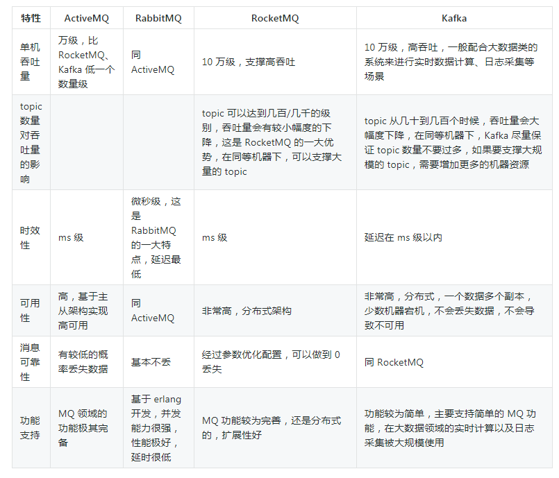

# mq

## 使用场景

+ 解耦
+ 异步
+ 削峰

## 缺点

+ 增加系统复杂度
+ 系统可用性降低：多了mq组件，mq挂了会影响整个系统
+ 一致性问题

## 对比

## 保证消费的幂等性

+ 检查一下拿到的数据已经已经处理，如果已处理则跳过
+ 中间加一层redis
+ 在消息里面加一个全局唯一id，消费者拿到之后检查是否处理过

## 保证消息的可靠性传输

### 消息丢失场景

#### 场景一

消息在生产者传输到MQ过程中丢失

##### 解决

+ 生产者发送数据之前开启MQ的事务，若消息没有被MQ接收到，生产者会收到异常报错（同步）
+ 生产者开启confirm模式，由MQ异步回传一个确认消息

#### 场景二

MQ收到消息，暂存内存，还未消息，MQ自己挂了，内存数据丢失

##### 解决

+ 开启MQ的持久化，生产者设置消息传输持久化

#### 场景三

消费者消费到了消息，但还没来得及处理就挂了，MQ以为消息已被处理

##### 解决

+ 关闭MQ的自动ack机制，由消费者确保处理完之后回传ack给MQ

## RabbitMQ

### 单机模式

### 普通集群模式（非高可用）

多台机器上启动多个RabbitMQ实例，但是数据只存放到一个实例，其他实例存放所有消息的路由信息。消费者随机连接一个实例，但是那个实例不一定存有消息，还需要去指定实例拉取数据，有拉取的开销。

### 镜像集群模式（高可用）

多台机器上启动多个RabbitMQ实例，每个实例都会存一份数据。

## 保证消息的顺序性

不同的消息拆分多个queue，消费者用各个内部队列接收各个queue，此时消费者各个内部队列拿到的消息是有序的