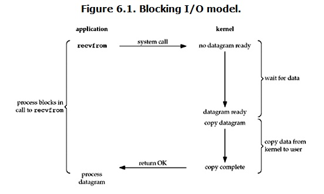

# IO

## read操作

+ 1. 等待数据准备
+ 2. 将数据从内核拷贝到进程中

## IO模式

### 阻塞IO

IO执行的2个阶段都被阻塞。

### 非阻塞IO

第一阶段由用户进程不断的主动询问数据准备好了没，第二阶段被阻塞。

### IO多路复用

select、poll、epoll，单个进程可以同时处理多个网络连接的IO，原理是不断轮询所负责的所有socket，当某个socket有数据准备好了就通知用户进程。优势在于能处理更多的连接。

### 信号驱动IO

### 异步IO

