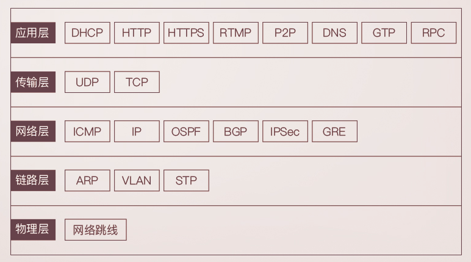
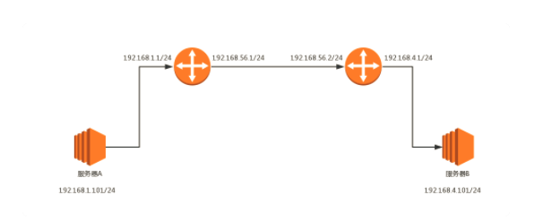
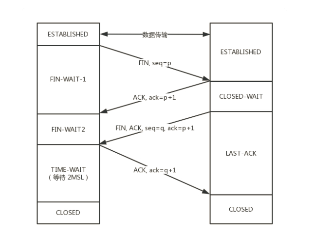

# http

## 浏览器缓存

### 强缓存

#### 原理

不发请求到服务器，从客户端缓存中加载资源。

#### 响应

http状态码为200,size显示“from cache”

#### header实现

+ Expires：描述一个绝对时间，由服务器返回。
+ Cache-Control：描述一个相对时间，以秒为单位。优先级高于Expires。

### 协商缓存

#### 原理

会发请求到服务器，但从客户端缓存中加载资源。

#### 响应

http状态码为304（Not Modified）

#### header实现

+ Last-Modified，If-Modified-Since：描述服务器上资源的修改时间。
+ ETag、If-None-Match：描述服务器上资源内容的修改，会根据算法生成资源的唯一标识，只跟资源内容是否变化有关。

#### 分布式系统注意事项

+ 分布式系统里多台机器间文件的Last-Modified必须保持一致，以免负载均衡到不同机器导致比对失败
+ 分布式系统尽量关闭掉ETag(每台机器生成的ETag都会不一样）

### 浏览器行为

+ ctrl+F5：跳过强缓存和协商缓存
+ F5：只跳过强缓存

## Restful API规范

### GET

不能改变服务器上任何RestFul资源的状态。

### PUT

保存数据，必须保证幂等。意思是同样的请求数据，无论请求多少次，服务器上资源的最终状态都为一致。

### DELETE

删除数据，必须保证幂等。

### POST

适用于诸多场景。允许不保证幂等。

# 网络分层模型



只要是在网络上跑的包，都是完整的。可以有下层没上层，绝对不可能有上层没下层。

## IP

### 查看IP地址

+ Linux：ifconfig、ip addr
+ Windows：ipconfig

### 无类型域间选路（CIDR）

将32位的IP地址一分为二，前面是网络号，后面是主机号。例如，10.100.122.2/24，这个IP地址中有一个斜杠，斜杠后面有个数字 24。这种地址表示形式，就是 CIDR。后面24的意思是，32位中，前24位是网络号，后8位是主机号。

伴随着CIDR存在的，一个是广播地址，10.100.122.255。如果发送这个地址，所有10.100.122网络里面的机器都可以收到。另一个是子网掩码，255.255.255.0。

将子网掩码和IP地址按位计算AND，就可得到`网络号`。

```
root@test:~# ip addr
1: lo: <LOOPBACK,UP,LOWER_UP> mtu 65536 qdisc noqueue state UNKNOWN group default 
    link/loopback 00:00:00:00:00:00 brd 00:00:00:00:00:00
    inet 127.0.0.1/8 scope host lo
       valid_lft forever preferred_lft forever
    inet6 ::1/128 scope host 
       valid_lft forever preferred_lft forever
2: eth0: <BROADCAST,MULTICAST,UP,LOWER_UP> mtu 1500 qdisc pfifo_fast state UP group default qlen 1000
    link/ether fa:16:3e:c7:79:75 brd ff:ff:ff:ff:ff:ff
    inet 10.100.122.2/24 brd 10.100.122.255 scope global eth0
       valid_lft forever preferred_lft forever
    inet6 fe80::f816:3eff:fec7:7975/64 scope link 
       valid_lft forever preferred_lft forever
```

`scope`：`global`表示可以对外的，可以接收来自各个地方的包。若是`host`，说明这张网卡仅仅可以供本机相互通信。

`link/ether`后面接的是`MAC地址`。

网络设备的状态标识

`<BROADCAST,MULTICAST,UP,LOWER_UP>`

+ UP：表示网卡处于启动的状态；
+ BROADCAST：表示这个网卡有广播地址，可以发送广播包；
+ MULTICAST：表示网卡可以发送多播包；
+ LOWER_UP：表示L1是启动的，也即网线插着呢。

`qdisc`后面接的是网络接口发送数据包的排队规则：

+ pfifo：不对进入的数据包做任何的处理，数据包采用先入先出的方式通过队列。
+ pfifo_fast：队列包括三个波段（band）。在每个波段里面，使用先进先出规则。band 0 的优先级最高，band 2 的最低。如果 band 0 里面有数据包，系统就不会处理 band 1 里面的数据包，band 1 和 band 2 之间也是一样。

### 配置IP地址

使用`net-tools`

```
$ sudo ifconfig eth1 10.0.0.1/24
$ sudo ifconfig eth1 up
```

使用`iproute2`

```
$ sudo ip addr add 10.0.0.1/24 dev eth1
$ sudo ip link set up eth1
```

### DHCP协议

DHCP Discover：新来的机器使用IP地址0.0.0.0发送了一个`广播包`，目的IP地址为255.255.255.255。广播包封装了UDP，UDP封装了BOOTP。

DHCP Offer：DHCP Server租给新机器一个IP地址。仍然使用`广播`地址作为目的地址。

新机器选择其中一个DHCP Offer，一般是最先到达的那个，并且会向网络发送一个DHCP Request`广播`数据包，包中包含客户端的MAC地址、接受的租约中的IP地址、提供此租约的DHCP服务器地址等，并告诉所有DHCP Server它将接受哪一台服务器提供的IP地址，告诉其他DHCP服务器，谢谢你们的接纳，并请求撤销它们提供的IP地址，以便提供给下一个IP租用请求者。

DHCP Server接收到客户机的DHCP request之后，会`广播`返回给客户机一个DHCP ACK消息包，表明已经接受客户机的选择，并将这一IP地址的合法租用信息和其他的配置信息都放入该广播包，发给客户机，欢迎它加入网络大家庭。

## ARP协议

已知IP求MAC地址。机器本地会进行一段时间的ARP缓存。

## ICMP协议（网络层）

`ping`（应用层）基于该协议。使用的是查询报文。

## 路由器（三层设备）

### 网关

路由器的一个网口。



#### 转发网关

源IP不变，只改变MAC地址。

（1）
源 MAC：服务器 A 的 MAC
目标 MAC：192.168.1.1 这个网口的 MAC
源 IP：192.168.1.101
目标 IP：192.168.4.101

（2）
源 MAC：192.168.56.1 的 MAC 地址
目标 MAC：192.168.56.2 的 MAC 地址
源 IP：192.168.1.101
目标 IP：192.168.4.101

（3）
源 MAC：192.168.4.1 的 MAC 地址
目标 MAC：192.168.4.101 的 MAC 地址
源 IP：192.168.1.101
目标 IP：192.168.4.101

#### NAT网关

NAT网关上有端口映射，适用于整个办公室共用一个到两个出口IP地址。

> 出口IP地址查询：https://www.whatismyip.com/ 

（1）
源 MAC：服务器 A 的 MAC
目标 MAC：192.168.1.1 这个网口的 MAC
源 IP：192.168.1.101
目标 IP：192.168.56.2

（2）
源 MAC：192.168.56.1 的 MAC 地址
目标 MAC：192.168.56.2 的 MAC 地址
源 IP：192.168.56.1
目标 IP：192.168.56.2

（3）
源 MAC：192.168.1.1 的 MAC 地址
目标 MAC：192.168.1.101 的 MAC 地址
源 IP：192.168.56.1
目标 IP：192.168.1.101

## TCP协议

四次挥手




