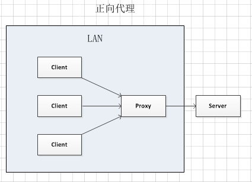
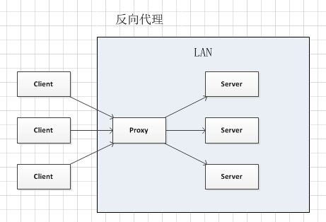

# nginx

## 代理

### 正向代理

正向代理类似一个跳板机，通过正向代理访问客户端无法访问到的服务端网络，比如翻墙。客户端需配置正向代理IP及端口。

### 反向代理

以代理服务器来接受internet上的连接请求，然后将请求转发给内部网络上的服务器，并将从服务器上得到的结果返回给internet上请求连接的客户端，此时代理服务器对外就表现为一个服务器。客户端不需任何配置。

## 跨域

当两个域具有相同的协议(如http), 相同的端口(如80)，相同的host（如www.google.com)，则认为它们是相同的域（协议，域名，端口都必须相同）。

### 作用

限制跨域资源访问的作用可从服务器和客户端两个方面进行分析： 

+ 对于服务器：当收到一个请求时，会检查该请求来源，如果来源的客户端页面自己无法识别，而且服务器的数据又是比较敏感的，则可能做出限制或者拒绝访问（例如，黑客对服务器的攻击）。 
+ 对于客户端：浏览器的同源策略可限制对跨域资源的访问，若其与服务器的域不相同，则浏览器可能进行限制甚至拒绝访问（例如，黑客通过让你访问他的服务器数据来攻击你的客户端页面）。

跨域访问失败时，实际上浏览器发送请求成功，浏览器也接收到了响应，但是它会限制xmlhttprequest接受响应并在js控制台报错。

###解决

`服务端`通过在`响应`中增加`Access-Control-Allow-Origin`标识的 `header`，指定服务器端允许进行跨域资源访问的来源域 

> 注：`Access-Control-Allow-Origin: *`，表示该资源谁都可以用。

